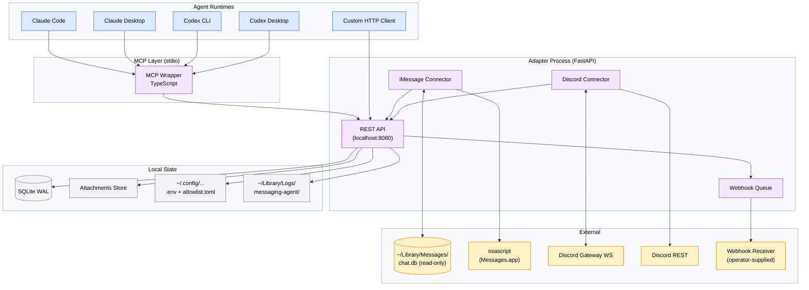

# Agent Messaging Channel (AMC)

The Agent Messaging Channel (AMC) is a personal-scale messaging gateway that
exposes the same four-tool MCP surface (and an equivalent REST surface) over
both iMessage and Discord, normalizing their very different I/O models behind a
single message envelope. v1 ships as a Python+FastAPI adapter on macOS,
supervised by `launchd`, with a thin TypeScript MCP wrapper for stdio-based
clients (Claude Code, Claude Desktop, Codex CLI, Codex Desktop) and a
documented direct-HTTP path for non-MCP consumers. The system is built
decoupled-by-design so that swapping the agent framework, the MCP wrapper, or
either connector requires no changes to the other layers.

## Architecture

Three layers, each independently replaceable: agent runtimes talk to the MCP
wrapper (or directly to the adapter over HTTP), the adapter is the source of
truth and owns persistence, and one connector per platform translates raw
events into the normalized envelope.



## Quick Links

Operator and reference docs (some land later in v1):

- [SETUP.md](SETUP.md) — operator runbook: macOS permissions, Discord bot
  creation, `.env`, allowlist, `launchd` install. *(coming in v1)*
- [docs/API.md](docs/API.md) — REST endpoints and MCP tool reference, generated
  from the adapter's OpenAPI plus a hand-written MCP section.
- [RUNBOOK.md](RUNBOOK.md) — common failures and recoveries (permission
  revoked, gateway disconnect, AppleScript failing, webhook outage, Mac
  asleep). *(coming in v1)*
- [Spec](specs/agent-messaging-channel-SPEC.md) — full technical specification
  (requirements, architecture, data models, API contracts, test plan).
- [Blueprint](internal/blueprints/agent-messaging-channel.md) — original
  architectural blueprint; the spec extends and, in two specific places,
  supersedes it.

## Components

### Adapter (Python)

The Python adapter under `amc/` is the source of truth: it owns the SQLite
store, runs the iMessage and Discord connectors as background tasks, and
exposes the REST surface plus the outbound webhook described in spec §5 / §7.4.

### MCP Wrapper (TypeScript)

The TypeScript MCP wrapper lives in [`mcp-wrapper/`](mcp-wrapper/) alongside
the Python adapter. It is a thin layer that translates the four MCP tools
(`list_unread_messages`, `send_message`, `mark_read`, `get_message_context`)
into HTTP calls against the adapter — see spec §5.6 / §7.4.7.

Quick start (from `mcp-wrapper/`):

```bash
npm install
npm run build      # produces dist/index.js
npm test           # vitest smoke + initialize-handshake tests
npm run lint
node dist/index.js # launches the stdio MCP server
```

Compatible with Node 20+ and Bun. The bundle has zero platform-specific
imports (no Discord SDK, no AppleScript / chat.db references); a build-time
test asserts this.

## Status

**Pre-v1, in active build.**

v1 acceptance is gated by an autonomous, automated test suite — not an
operator soak. The build-acceptance gate (spec §9.4) requires:

- Bounded stability run (≤ 60 minutes, 1 msg/s synthetic traffic against the
  Phase 0 fakes) completes with zero unhandled exceptions and P95 latencies
  within the §6.1 targets (receive→visible < 3 s, send→ack < 2 s).
- Webhook delivery success rate ≥ 95% on first attempt.
- Crash-and-relaunch test passes (RPO=0 inbound, no duplicate sends).
- `launchd` plist passes `plutil -lint`; backup script unit-tested.
- Documentation finalized; docs-lint passes (links resolve, code blocks parse).

Real-Mac soak by an operator is *post-handoff* and is explicitly **not** a
build-acceptance gate.

## Project Notes

Implementer and operator notes that are not part of the public spec live under
`internal/notes/`:

- [`internal/notes/phase0-findings.md`](internal/notes/phase0-findings.md) —
  what we learned while building the Phase 0 test fixtures and fakes (chat.db
  quirks, fake Discord gateway protocol coverage map, and test-ergonomics
  decisions).

## License

TBD.
