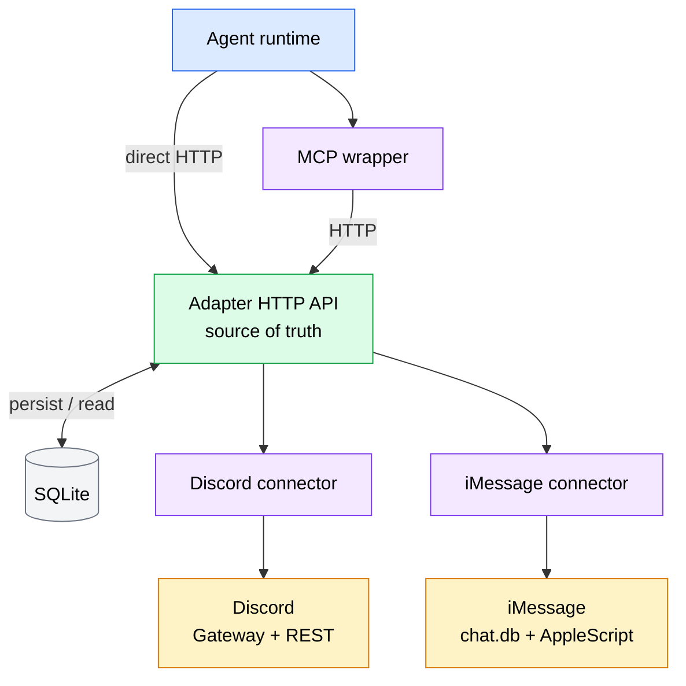
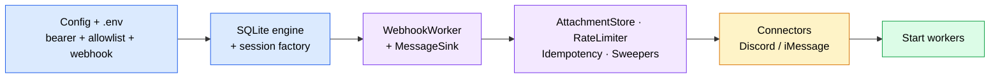
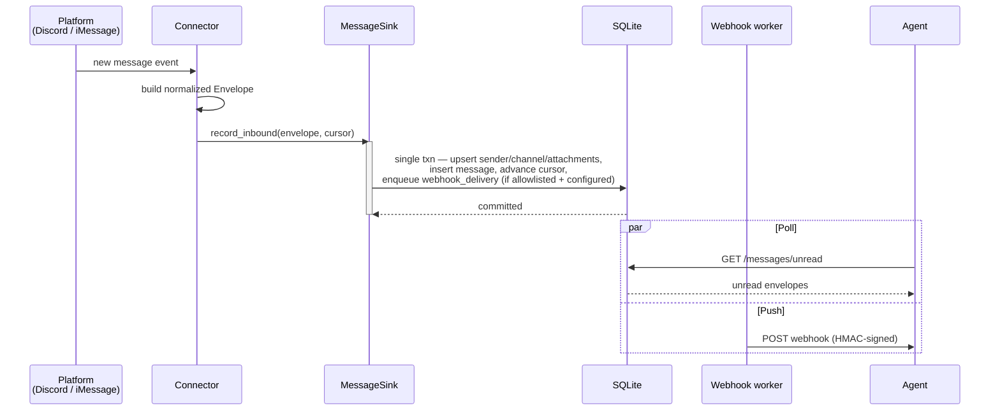
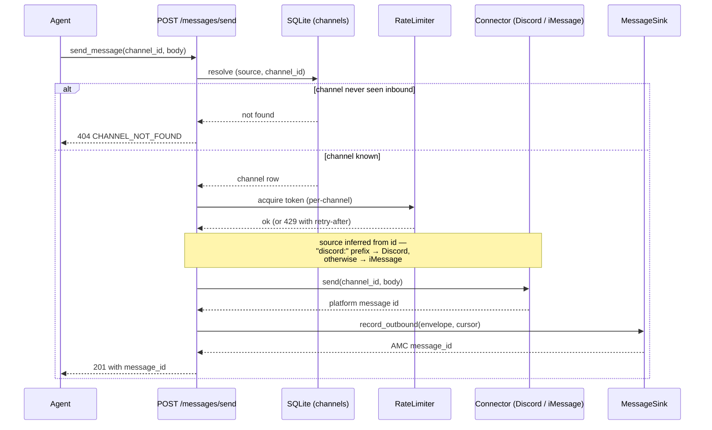

# Architecture Overview

The Agent Messaging Channel (AMC) lets a single AI agent send and receive messages on **iMessage** and **Discord** through one unified, bearer-protected REST surface. This page explains how the adapter is composed, what it exposes, and how a message travels through the system in each direction.

The guiding design principle is **decoupling**: the agent runtime, the transport, and the platform connectors are each replaceable without rewriting the others. That decoupling is enforced by a small number of stable contracts — the [normalized message envelope](message-envelope.md), the [REST API](../reference/rest-api.md), and the [MCP tool surface](../reference/mcp-tools.md).

## The three-layer model

AMC is organized as three layers, each independently replaceable:

1. **Agent runtimes** — any agent that can either speak MCP or make HTTP calls.
2. **MCP wrapper (or direct HTTP)** — a thin Python layer (FastMCP) that translates four MCP tools into HTTP calls against the adapter. It contains **zero platform-specific code**; agents that don't speak MCP skip this layer and call the adapter directly.
3. **Adapter HTTP API** — the **source of truth**. A single FastAPI process that owns persistence (SQLite), runs the connectors as background tasks, and exposes the REST surface plus an outbound webhook.

Below the adapter sit the **connectors** (one per platform) and the platforms themselves.

!!! info "The wrapper is intentionally dumb"
    The MCP wrapper holds no knowledge of iMessage or Discord. Adding a new platform means writing one connector that produces the normalized envelope — the wrapper, the REST surface, and the storage schema stay unchanged. See the [Connectors overview](../connectors/index.md).

## The adapter process

The adapter is constructed by `build_app()` in `amc/app.py`, which returns a FastAPI instance whose **lifespan** wires up everything on startup and tears it down in reverse on shutdown. The module-level `app = build_app()` is what production entry points bind to (`uvicorn amc.app:app`).

The adapter is the **single source of truth**: every inbound and outbound message lives in its SQLite database, and connectors run as in-process background tasks rather than as separate services.

### Startup ordering

On startup the lifespan runs the following steps, in order:

1. **Config + secrets.** Loads `~/.config/messaging-agent/.env` into `os.environ` via python-dotenv (process env wins on conflict), validates `AMC_BEARER_TOKEN`, loads the allowlist (`~/.config/messaging-agent/allowlist.toml` or `$AMC_ALLOWLIST_PATH`), and loads the webhook config (`AMC_WEBHOOK_URL` + `AMC_WEBHOOK_SECRET`).
2. **Storage.** Creates the async SQLite engine from `$AMC_DB_PATH` and builds an async session factory, both stored on `app.state`.
3. **Sink + webhook worker.** Instantiates the `WebhookWorker`, then builds the `MessageSink` (wired with the allowlist and webhook config) and stores it on `app.state`.
4. **Supporting services.** Sets up the `AttachmentStore` (bind URL from `AMC_BIND_HOST` / `AMC_BIND_PORT`, default `127.0.0.1:8080`), the per-channel `RateLimiter`, the `IdempotencyStore` + `IdempotencySweeper`, and the `AttachmentSweeper` (daily sweep, 90-day retention).
5. **Connectors (conditional).** Starts **Discord** if `$AMC_DISCORD_BOT_TOKEN` is set (launched as an asyncio task); starts **iMessage** only on macOS (`sys.platform == "darwin"`) when `~/Library/Messages/chat.db` is readable. Each connector that starts registers with the `/healthz` registry; the others surface as `disabled`.
6. **Workers.** Starts the webhook worker, the idempotency sweeper, and the attachment sweeper.

### Shutdown ordering

On shutdown the lifespan stops everything in **reverse order** so in-flight work drains first: attachment sweeper, idempotency sweeper, webhook worker, then the connectors, and finally `engine.dispose()`.

!!! tip "Running the adapter"
    Day-to-day, the adapter is managed by the `amc` operator CLI (`amc serve adapter`, `amc install`, `amc status`). See the [amc CLI](../reference/cli.md) and the [Getting Started](../getting-started/index.md) guide.

## Request surfaces

`build_app()` mounts eight routers. Every route is protected by bearer authentication (`Authorization: Bearer <token>`); the per-agent **read** endpoints additionally require an `X-Agent-ID` header so unread/read state is tracked per agent.

| Method | Path | Purpose |
|--------|------|---------|
| `GET`  | `/messages/unread`   | List messages this agent has not yet marked read |
| `GET`  | `/messages/{id}`     | Fetch a single normalized message by AMC id |
| `GET`  | `/messages/context`  | Fetch surrounding messages for a channel/thread |
| `POST` | `/messages/mark_read`| Mark one or more messages read for this agent |
| `GET`  | `/messages/quarantine`| List inbound messages held by the allowlist |
| `POST` | `/messages/send`     | Send an outbound message to a known channel |
| `GET`  | `/attachments/{id}`  | Serve a re-hosted attachment by `att_` id |
| `GET`  | `/healthz`           | Liveness + per-connector health |

The `X-Agent-ID` header is required on `/messages/unread`, `/messages/{id}`, `/messages/context`, and `/messages/mark_read` (the per-agent surfaces). It is **not** consulted by `/messages/quarantine`, `/attachments/{id}`, or `/healthz`.

Beyond these, the schema and docs routes — `GET /openapi.json`, `/docs`, `/redoc` — are re-registered behind the same bearer dependency rather than left anonymous, so the API surface is never exposed to anyone who can merely reach the bind address.

!!! note "`/typing` is defined but not mounted"
    A typing-indicator route exists at `amc/api/typing.py` (`POST /typing`) but is **not** included in `build_app()` yet. Treat it as planned, not live.

For full request/response shapes see the [REST API reference](../reference/rest-api.md). For the agent-facing tool names that map onto these endpoints, see [MCP Tools](../reference/mcp-tools.md).

## The MessageSink chokepoint

Every message that enters or leaves the system is persisted through a single component, `MessageSink` (`amc/core/message_sink.py`). Connectors call `record_inbound`; the send route calls `record_outbound`. Both run the same single SQLite transaction that:

1. **UPSERTs** the sender, the channel, and any attachments.
2. **INSERTs** the message row.
3. **Advances the connector cursor** (`connector_state.cursor`) for that source — atomically with the message INSERT, so a crash mid-transaction can never leave the cursor ahead of the data.
4. **Enqueues a `webhook_deliveries` row** — but only for **inbound** messages that pass the allowlist, and only when a webhook is configured.

!!! warning "One write path, by design"
    Because every write funnels through the sink's single transaction, the storage schema, cursor durability, and webhook fan-out stay consistent regardless of which connector or route triggered the write. Do not add side paths that write `messages` directly.

See the [Storage Schema](storage.md) for the tables these writes touch.

## Inbound data flow

A platform event becomes a normalized [message envelope](message-envelope.md), is persisted via `record_inbound`, and reaches the agent either by **poll** (`GET /messages/unread`) or by **push** (the configured webhook receiver).

The push path is handled by a separate process — see the [Webhook Receiver](../operations/webhook-receiver.md).

## Outbound data flow

An agent sends by calling the MCP `send_message` tool or `POST /messages/send` directly. The adapter only sends to channels it has already observed inbound.

Source inference is purely string-based: a `channel_id` beginning with `discord:` (e.g. `discord:dm:<id>` or `discord:channel:<id>`) routes to the Discord connector; anything else (an E.164 phone number or a chat GUID) routes to iMessage. See the [iMessage](../connectors/imessage.md) and [Discord](../connectors/discord.md) connector pages for how each platform sends.

## Background workers

Three asyncio workers run for the lifetime of the adapter process:

- **Webhook worker** — delivers `webhook_deliveries` rows to the configured `AMC_WEBHOOK_URL`, signing each payload with HMAC-SHA256 and retrying on failure with exponential backoff (`1s, 5s, 30s, 2m, 10m`).
- **Idempotency sweeper** — runs hourly, expiring `Idempotency-Key` records past their 24-hour TTL so the dedup table doesn't grow unbounded.
- **Attachment sweeper** — runs daily, deleting re-hosted attachments past the 90-day retention window.

All three are tunable via environment variables documented in the [Configuration reference](../reference/configuration.md).

## Where to next

- [Connectors overview](../connectors/index.md) — how each platform connector produces the normalized envelope.
- [Storage Schema](storage.md) — the SQLite tables the `MessageSink` writes through.
- [Message Envelope](message-envelope.md) — the wire shape every message conforms to.
