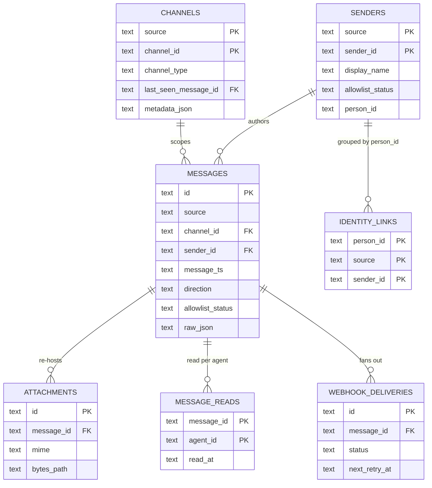

# Storage Schema

The adapter is the **single source of truth**, and its truth lives in one SQLite database. Every inbound and outbound message, every discovered channel and sender, every queued webhook, and every connector cursor is persisted there — there is no second store and no in-memory state that survives a restart.

The persistence engine is **SQLite in WAL mode** with `PRAGMA foreign_keys = ON`. Table definitions are declared as **SQLAlchemy Core** `Table` objects in `amc/core/schema.py` (no ORM — the adapter is a small CRUD service with hand-written SQL paths). The runtime engine in `amc/core/db.py` consumes the same `metadata`. Schema changes ship as **Alembic** revisions under `amc/migrations/versions/` (currently `001_init` and `002_outbound_status`).

The original blueprint named **four** core tables — `messages`, `channels`, `senders`, `identity_links`. The implementation has **nine**: those four, joined by **five operational tables** (`message_reads`, `attachments`, `webhook_deliveries`, `idempotency_keys`, `connector_state`) that carry per-agent read state, re-hosted attachment metadata, the webhook fan-out queue, the send idempotency cache, and per-platform cursors. This page documents the real, current schema.

!!! info "Where the shapes come from"
    The columns below mirror `amc/core/schema.py` exactly, including its `CHECK` constraints and indexes. If you are looking for the JSON *wire* shape of a message rather than its row layout, see the [Message Envelope](message-envelope.md).

## Entity relationships



`connector_state` and `idempotency_keys` are standalone bookkeeping tables (no foreign keys to the core graph) and are omitted from the diagram for legibility; both are documented below.

## The single write path

Every row in `messages`, together with its `channels` / `senders` upserts, its `attachments` rows, the connector cursor advance, and the optional `webhook_deliveries` enqueue, is written by **one chokepoint**: the `MessageSink` in `amc/core/message_sink.py`. Connectors and the send route all call `sink.record_inbound(...)` / the outbound equivalent, and the sink performs the whole set of writes in a **single transaction**. Nothing else inserts into `messages` directly.

This is why the schema can rely on referential integrity without elaborate retry logic: a message and the channel/sender it references either land together or not at all. See the [Architecture overview](index.md) for how the sink sits inside the adapter lifespan.

## Tables

### messages

The core store — every message, inbound and outbound, in normalized form.

- **PK** `id` — `TEXT`, formatted `msg_<ULID>` (ULID makes the id sortable by creation time).
- `source` — `imessage` or `discord` (CHECK-constrained).
- `channel_id`, `sender_id` — composite FKs into `channels` and `senders` (both keyed on `(source, ...)`).
- `message_ts` — platform-reported timestamp; `created_at` — when the adapter persisted the row.
- `text`, `direction` (`inbound` / `outbound`), `channel_type` (`dm` / `group`).
- `allowlist_status` — `allowed`, `unknown`, or `outbound`. The `outbound` value is a snapshot meaning "agent-sent, allowlisting did not apply."
- `delivery_status` — `NULL` on inbound rows; `pending` / `sent` / `send_failed` on outbound rows (added by `002_outbound_status`; v1 persists only `sent`).
- `reply_to` — self-referential FK (deferrable) to another `messages.id`.
- `raw_json` — the **original platform payload**, preserved verbatim so an operator can re-decode after a platform schema change without having lost data.

Indexes: `(channel_id, message_ts DESC)`, `(allowlist_status, message_ts DESC)`, `(source, created_at DESC)` — the unread/feed query shapes.

### channels

Discovered channels (DMs and group chats), upserted as messages arrive.

- **Composite PK** `(source, channel_id)`.
- `channel_type` — `dm` or `group`.
- `last_seen_message_id` — deferrable FK back into `messages` (the channels↔messages cycle is why both FKs are `DEFERRED`).
- `metadata_json` — platform-specific data the connector needs later, e.g. the iMessage **`chat_guid`** that AppleScript requires to address an outbound send.

### senders

Discovered senders, upserted on first sighting.

- **Composite PK** `(source, sender_id)`.
- `display_name`, `allowlist_status` (`allowed` / `unknown`).
- `person_id` — the cross-platform identity key copied from the allowlist; `NULL` for senders not yet linked.
- `first_seen`, `last_seen` — observation timestamps.

Index: `(person_id)` — drives the identity-grouping rebuild.

### identity_links

A **materialized** cross-platform identity grouping, derived from the allowlist's `person_id`. This is what lets the agent treat one human's iMessage and Discord identities as the same person.

- **Composite PK** `(person_id, source, sender_id)`.
- FK on `(source, sender_id)` into `senders`.
- **Rebuilt on SIGHUP** when the allowlist is reloaded — it is a projection of the allowlist, not an independent source of truth.

### message_reads

Per-agent read state — the table that makes the unread cursor **per-agent** rather than global.

- **Composite PK** `(message_id, agent_id)`.
- `read_at` — when that agent marked the message read.
- This is the **UPSERT target** of `POST /messages/mark_read`.

Index: `(agent_id, read_at DESC)`.

### attachments

Re-hosted attachment metadata (the bytes live on disk, not in the row).

- **PK** `id` — `TEXT`, formatted `att_<ULID>`.
- `message_id` — FK into `messages`.
- `mime`, `size_bytes`.
- `bytes_path` — local file location of the stored bytes; **nulled** when the retention sweeper deletes the bytes (the metadata row survives so history stays coherent).
- `created_at` — drives retention.

Indexes: `(message_id)`, `(created_at)`.

### webhook_deliveries

The outbound webhook fan-out queue, drained by the webhook worker.

- **PK** `id` — `TEXT` ULID.
- `message_id` — FK into `messages`.
- `status` — `pending`, `delivered`, or `dead` (CHECK-constrained; the migration/spec terminal-fail state for the worker).
- `attempt`, `next_retry_at` — backoff bookkeeping.
- `last_response_code`, `last_error` — last delivery outcome for diagnostics.

Index: `(status, next_retry_at)` — the worker's queue-poll shape.

### idempotency_keys

The `Idempotency-Key` cache for `POST /messages/send`, so a retried send returns the original response instead of double-sending.

- **PK** `key` — the client-supplied `Idempotency-Key`.
- `request_hash` — SHA-256 of the request body (mismatch on the same key is a conflict).
- `response_status`, `response_body` — the cached response replayed on a repeat.
- `expires_at` — 24-hour TTL.

Index: `(expires_at)` — the sweeper's reap query.

### connector_state

A per-platform cursor checkpoint so polling/streaming survives restarts.

- **PK** `source`.
- `cursor` — the platform-native watermark, stored as text:
    - **iMessage** — a `chat.db` `ROWID` as a decimal string.
    - **Discord** — a JSON blob, e.g. `{"seq": .., "resume_url": ..}`.
- `updated_at` — last checkpoint write.

## Engine notes

These three behaviors are load-bearing and easy to get wrong:

!!! warning "WAL + foreign keys are set in a connect-event listener"
    `journal_mode = WAL` and `PRAGMA foreign_keys = ON` are applied via a SQLAlchemy **`connect`-event listener** on the engine, so every pooled connection gets them at bootstrap. They are **not** applied with `connection.exec_driver_sql(...)` *after* connecting — doing that silently corrupts the Alembic stamp commit. If you add new PRAGMAs, add them to the listener, not to call sites.

!!! note "Timestamps are lexically sortable on purpose"
    Timestamps are stored as `TEXT` in fixed-width ISO 8601 with **6-digit microseconds and a `Z` suffix** (the server default is `strftime('%Y-%m-%dT%H:%M:%fZ', 'now')`). The fixed width and trailing `Z` guarantee that SQLite's `TEXT` lexical ordering matches chronological ordering — the `'.' < 'Z'` rule is what makes `message_ts DESC` indexes correct without parsing dates.

The PRAGMA setup looks like this:

```sql
PRAGMA journal_mode = WAL;
PRAGMA foreign_keys = ON;
```

### Database location

By default the database is `state.db` under `~/Library/Application Support/messaging-agent/`. The path is overridable with `AMC_DB_PATH`; see [Configuration](../reference/configuration.md).

!!! info "`state.db` vs `amc.db`"
    Some operator docs and the spec refer to the database file as `amc.db`. That is a tracked spec↔code divergence — **the code default is `state.db`.** When in doubt, trust `AMC_DB_PATH` (or the default `state.db`) over any doc that says `amc.db`.

## Inspecting the database

The store is plain SQLite, so any client works. A few useful introspection queries:

```sql
-- All nine tables.
SELECT name FROM sqlite_master WHERE type = 'table' ORDER BY name;

-- Unread messages for an agent (no read row for that agent).
SELECT m.id, m.source, m.channel_id, m.message_ts, m.text
FROM messages m
LEFT JOIN message_reads r
  ON r.message_id = m.id AND r.agent_id = :agent_id
WHERE m.direction = 'inbound'
  AND r.message_id IS NULL
ORDER BY m.message_ts DESC;

-- Webhook deliveries still owed.
SELECT id, message_id, status, attempt, next_retry_at, last_error
FROM webhook_deliveries
WHERE status = 'pending'
ORDER BY next_retry_at;

-- Current connector cursors.
SELECT source, cursor, updated_at FROM connector_state;
```

## See also

- [Message Envelope](message-envelope.md) — the normalized wire shape that `messages` rows serialize to.
- [Configuration](../reference/configuration.md) — `AMC_DB_PATH` and related settings.
- [Architecture overview](index.md) — where the `MessageSink` write path sits in the adapter lifespan.
- [Runbook](../operations/runbook.md) — DB diagnostic queries and recovery procedures.
- [Connectors overview](../connectors/index.md) — what produces the rows in `messages`, `channels`, and `senders`.
