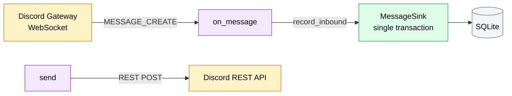

# Discord Connector

The Discord connector bridges Discord and AMG in both directions. It lives at `amg/connectors/discord/connector.py` and is a subclass of `discord.Client` — it relies on the [`discord.py`](https://github.com/Rapptz/discord.py) library for the Gateway WebSocket protocol and the Discord REST API.

- **Inbound** is push: Discord delivers `MESSAGE_CREATE` events over a persistent Gateway WebSocket, and the connector's `on_message` handler turns each one into a normalized [message envelope](../architecture/message-envelope.md).
- **Outbound** is pull: `DiscordConnector.send(...)` resolves the target channel and posts the message over the Discord REST API.

The connector requires a **bot token**, supplied via `AMG_DISCORD_BOT_TOKEN`. It only starts when that variable is set — see [Configuration](../reference/configuration.md). On a Discord-only deployment this is the only connector that runs; on a host with no token configured the source simply reports `disabled` in `/healthz`.



## Intents

The connector starts from `discord.Intents.none()` and enables exactly four intents:

| Intent | Purpose |
|---|---|
| `guilds` | Track guild and channel metadata. |
| `messages` | Receive `MESSAGE_CREATE` events. |
| `message_content` | Read the actual text of each message (**privileged**). |
| `dm_messages` | Receive direct-message events. |

!!! danger "Enable the Message Content Intent in the Developer Portal"
    `message_content` is a **privileged** intent. Requesting it in code (which the connector does) is not enough — it must **also** be enabled for the application in the Discord Developer Portal, under **Bot → Privileged Gateway Intents → Message Content Intent**.

    Without it, the gateway still delivers `MESSAGE_CREATE` events but with an **empty `content` field**, so the connector receives every message as blank text and cannot read what was said. The step-by-step toggle is covered in the [Setup Guide](../getting-started/index.md).

## Gateway lifecycle

The connector does not implement the Gateway protocol itself. `discord.py` manages **IDENTIFY**, **RESUME**, **heartbeat**, and **reconnect** internally; the connector just subclasses `discord.Client` and lets the library drive the socket. In production the connector defers to the parent `Client.login()` for the real OAuth round-trip and gateway connect, and is run exactly like a normal bot:

```python
await connector.start(bot_token)
```

If authentication fails — a revoked or invalid bot token surfacing as `discord.Forbidden` or an HTTP `401` — the connector sets `degraded = True`. The `/healthz` endpoint reads that flag and surfaces the source as `degraded`; see the [Runbook](../operations/runbook.md). The flag is owned by the connector; `/healthz` only reads it.

!!! note "Overridable gateway URL (testing only)"
    The connector accepts a `gateway_url` constructor kwarg. When set, `login()` follows a test-harness path: it skips the live HTTP login and redirects `DiscordWebSocket.DEFAULT_GATEWAY` to a fake `ws://...` URL, so the test suite can exercise the full inbound flow against an in-process fake gateway. When `gateway_url` is `None` (production), the real `Client.login` runs unchanged.

## Inbound: `on_message`

`on_message` fires on every `MESSAGE_CREATE`. For each event it:

1. **Skips the bot's own messages** — if `message.author.id == self.user.id`, it returns immediately. The bot's outbound messages are recorded by `send`, not here.
2. **Classifies the channel** — a DM, or a guild text channel. Guild channels can be restricted by an **allow-list of channel ids** (`allowed_guild_channels`); when the list is configured, a guild message whose channel id is not on it is dropped. DMs are always processed.
3. **Builds the normalized envelope** from the `discord.Message`.
4. **Snapshots the cursor** (see below).
5. **Hands it to the sink** — `await sink.record_inbound(envelope, source=<cursor_json>)`, which persists the message and advances the cursor inside one transaction.

!!! note "Errors don't kill the dispatcher"
    Any unexpected exception inside `on_message` is logged but **not** re-raised, so `discord.py`'s event dispatcher keeps running and a single bad message can't stall the inbound stream.

## Cursor snapshot

Discord's resume checkpoint is a small JSON object, persisted in `connector_state.cursor` for `source='discord'` (see [Storage Schema](../architecture/storage.md)):

```jsonc
{
  "seq": 4821,          // last gateway sequence number observed (or null)
  "resume_url": "wss://gateway.discord.gg" // resume gateway URL from READY (or null)
}
```

Both fields are persisted but never authoritatively consumed by the connector — `discord.py` manages its own RESUME loop in memory. They are written so an operator can inspect cursor progress and so a future reconnect-from-DB story can lift them without a schema change. Before the gateway has connected (for example on a fresh install), both fields are `null`.

## Row → envelope mapping

The connector translates each `discord.Message` into the [normalized message envelope](../architecture/message-envelope.md) as follows:

| Envelope field | Value from the Discord message |
|---|---|
| `source` | `discord` |
| `channel_id` | `discord:dm:<snowflake>` for a DM, `discord:channel:<snowflake>` for a guild channel |
| `channel_type` | `dm` (DM) or `group` (guild channel) |
| `sender.id` | `str(message.author.id)` — the author snowflake as a string |
| `sender.display_name` | allow-list override if configured, else `global_name` → `name` → the id |
| `sender.person_id` | from the matching allow-list entry, else `null` |
| `text` | `message.content` (or `""` when empty) |
| `attachments` | **empty list** — inbound attachment re-hosting is not yet implemented |
| `reply_to` | `null` — cross-platform reply mapping is post-v1 |
| `timestamp` | `message.created_at`, coerced to UTC |
| `direction` | `inbound` |
| `raw` | `discord_message_id`, `discord_channel_id`, `discord_author_id`, `discord_guild_id`, `discord_message_reference_id` |

!!! warning "Inbound attachments are dropped for now"
    `attachments` is always an **empty list** on inbound Discord messages. Inbound attachment re-hosting is not yet implemented, so files sent to the bot are not currently captured in the envelope. The original message reference id is preserved under `raw.discord_message_reference_id` even though `reply_to` is left `null`.

## Outbound: send

`DiscordConnector.send(channel_id, text, *, reply_to=None, attachments=None)` posts a message over the Discord REST API:

1. **Parse the channel id.** `discord:dm:123` resolves to DM channel `123`; `discord:channel:123` resolves to guild channel `123`.
2. **Resolve the channel.** First `client.get_channel(snowflake)` (the in-memory cache); if that misses, fall back to a `PartialMessageable`. DMs are rarely cached, so they almost always go through the `PartialMessageable` path — which still routes `channel.send` to `POST /channels/{id}/messages`.
3. **Build a reply reference** when `reply_to` is set — a `discord.MessageReference` with `fail_if_not_exists=False`, so replying to a since-deleted message doesn't fail the send.
4. **Send** — `channel.send(text, reference=..., file(s)=...)`.

On success the call returns `SendResult(ok=True, message_id=str(sent.id))`. Failures are mapped to AMG error codes:

| Discord exception | AMG error code |
|---|---|
| `discord.Forbidden` (401 / 403) | `PLATFORM_AUTH` (also flips `degraded = True`) |
| any other `discord.HTTPException` | `PLATFORM_SEND_FAILED` |

!!! note "`discord.py` retries before failing"
    `discord.py` retries `5xx` and rate-limited (`429`) responses internally; only the final outcome reaches `send`. A persistent server error surfaces as an `HTTPException` and is reported as `PLATFORM_SEND_FAILED`.

## The `channel_id` format

Discord channels are addressed with a `discord:`-prefixed id:

- **DM** — `discord:dm:<snowflake>`
- **Guild channel** — `discord:channel:<snowflake>`

The `discord:` prefix is how the adapter routes an outbound send to **this** connector rather than to iMessage. The connector is the only component that builds or parses these strings; the adapter and MCP layers treat them as opaque.

!!! tip "Finding a snowflake"
    To get a user's snowflake for the allow-list, enable **Developer Mode** in Discord (**Settings → Advanced → Developer Mode**), then right-click the user and choose **Copy User ID**. The [Setup Guide](../getting-started/index.md) walks through this.

## Attachments

!!! warning "Attachment support is not yet implemented"
    **Outbound** — attaching a file to a Discord send currently returns `413 ATTACHMENT_TOO_LARGE_FOR_PLATFORM`; pass-through is not yet implemented. (For reference, Discord's standard upload limit is 25 MB.)

    **Inbound** — attachment re-hosting is not yet implemented, so inbound files are dropped and the envelope's `attachments` list is always empty.

## See also

- [Connectors overview](index.md)
- [iMessage connector](imessage.md)
- [Runbook](../operations/runbook.md) — Discord-disconnect scenarios, including gateway close codes `4004`, `4013`, and `4014`
- [Configuration](../reference/configuration.md)
- [Getting Started](../getting-started/index.md)
