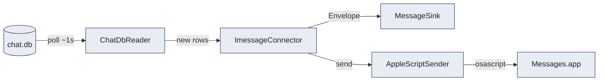

# iMessage Connector

The iMessage connector bridges Apple Messages and AMG on a single Mac. It lives at
`amg/connectors/imessage/` and is split into three modules:

- `reader.py` — a read-only async reader over `~/Library/Messages/chat.db` (the **inbound** half).
- `connector.py` — the background poller plus the outbound AppleScript driver wiring.
- `applescript.py` — the `osascript` subprocess wrapper that drives Messages.app (the **outbound** half).

Inbound messages are read by polling the local SQLite `chat.db`; outbound messages are sent by
driving Messages.app through AppleScript. v1 supports **direct messages only** — group chats are
filtered out at the SQL layer.

!!! warning "macOS requirements (read before you run this)"
    The iMessage path depends on three host-level conditions that fail silently if unmet:

    - **Full Disk Access** must be granted to the adapter process so it can read `chat.db`.
      Without it, the reader raises at construction and `/healthz` reports the connector as
      `degraded`.
    - The **first outbound send triggers an Automation prompt** for Messages.app. Until you accept
      it, AppleScript sends fail silently.
    - The **Mac must stay awake** (`caffeinate -dimsu` or Energy settings). When it sleeps, polling
      stops and a backlog accumulates.

    See the [Setup Guide](../getting-started/index.md) for how to grant each of these.



## Inbound: the polling loop

A background asyncio task polls `ChatDbReader.fetch_new(cursor)` every `~1.0s`
(`DEFAULT_POLL_INTERVAL_SECONDS`, the spec acceptance criterion: new rows are picked up within one
second). Rows come back in **ascending `ROWID` order**, and the `ROWID` of the last processed row is
the cursor. The cursor is persisted as a **decimal string** in the `connector_state.cursor` column
(it is `TEXT NOT NULL`, so the integer is stored as `"42"` and parsed back with `int()`). See the
[Storage Schema](../architecture/storage.md) for the `connector_state` table.

The reader filters to DM threads (`chat.style = 45`) at the SQL layer and opens `chat.db` strictly
read-only (`mode=ro` URI plus `PRAGMA query_only = ON`). Every SQLite call runs in a worker thread
so the event loop never blocks.

### Cursor recovery

The starting cursor is resolved once at boot:

- **Warm restart** — a `connector_state` row exists for `source='imessage'`. The poller resumes
  from that `ROWID`; the first `fetch_new` uses `WHERE ROWID > cursor`, so already-persisted rows
  are never re-emitted. The cursor was advanced inside the same transaction as each message INSERT,
  so it never points ahead of the persisted messages.
- **Fresh install** — no cursor row. The cursor is seeded to `MAX(message.ROWID)` from `chat.db` so
  the entire historical backlog is **not** replayed as "new". The seed is in-memory only; it is
  persisted on the next inbound row's sink transaction.
- **Cursor read failure** — the AMG DB is unreadable/corrupt. The connector logs an `ERROR` and
  falls back to the fresh-install path (seed to `MAX(message.ROWID)`). This keeps the connector live
  on a transient hiccup; the next sink transaction heals the cursor row.

### ROWID gap detection

Each cycle compares the cursor to the maximum `ROWID` returned. A gap greater than `100`
(`ROWID_GAP_WARN_THRESHOLD`) logs a `WARN` — a signal of a Mac wake, network hiccup, or a
Messages.app backlog catch-up. Processing semantics do not change: every gap row is still processed
in ascending `ROWID` order. Steady-state traffic produces tiny gaps and never trips the threshold.

## Decoding message text

When `message.text` is present, it is used directly. When it is `NULL`, the connector decodes the
`attributedBody` blob via `decode_attributed_body` in `reader.py`. The decoder anchors on the
`NSString` class declaration, brackets the payload using the `\x86` attribute-run sentinel, walks
back to the length prefix, and validates the result as UTF-8. On any failure it returns `None`, and
the connector falls back to `message.text` (which may itself be `None`).

!!! note "`attributedBody` is a typedstream archive, not a plist"
    The `attributedBody` blob is an **Apple typedstream archive** — *not* an `NSKeyedArchiver`
    archive and *not* a binary plist. It is identified by the magic bytes
    `\x04\x0Bstreamtyped`. Decoders that reach for `plistlib` or `NSKeyedUnarchiver` will not work
    on this format.

## Handle normalization

Each chat.db `handle.id` is normalized into the AMG channel/sender id:

- **Email handles** (those containing `@`) are treated as Apple-ID emails and preserved.
- **Phone handles** are stripped to digits and normalized to E.164:
    - a 10-digit US number gets `+1` prepended (`5551234567` to `+15551234567`),
    - an 11-digit number starting with `1` gets `+` prepended (`15551234567` to `+15551234567`),
    - any other numeric input gets a best-effort bare `+` prefix.

## Timestamps

`message.date` in `chat.db` is **mach absolute time**: nanoseconds since `2001-01-01 UTC`. The
connector converts it as:

```text
timestamp = MACH_EPOCH + timedelta(seconds=date_ns / 1_000_000_000)
```

where `MACH_EPOCH` is `2001-01-01 00:00:00 UTC`. The resulting envelope `timestamp` is emitted as
RFC 3339 UTC with a `Z` suffix.

## Row to envelope mapping

Each inbound `chat.db` row is translated into a normalized
[message envelope](../architecture/message-envelope.md):

| Envelope field | Source / value |
| --- | --- |
| `source` | `imessage` |
| `channel_id` | Normalized handle (E.164 phone or Apple-ID email) — **no prefix** |
| `channel_type` | `dm` (v1 supports DMs only) |
| `sender.id` | Same as `channel_id` (handle == channel == sender id) |
| `sender.display_name` | Allowlist entry's display name, else the handle |
| `sender.person_id` | Allowlist entry's `person_id`, else `None` |
| `text` | `message.text`, else decoded `attributedBody`, else empty |
| `attachments` | Re-hosted; each gets an `att_` id and an adapter-hosted URL |
| `reply_to` | `None` (iMessage threading is post-v1) |
| `timestamp` | Converted from mach time, RFC 3339 UTC `Z` |
| `direction` | `inbound` |
| `raw` | Includes `rowid`, `chat_guid`, `sender_kind`, and a `chat_db_row` snapshot |

The display name and `person_id` come from the allowlist resolver. Outbound rows
(`is_from_me = 1`) are skipped by the poller — the adapter records the API-driven outbound copy
instead, so the OS-level copy never double-counts.

## Attachments

Inbound attachments are **re-hosted** rather than passed through. The reader joins
`message_attachment_join` and `attachment` to enumerate the files; the connector copies each one's
bytes into the adapter's attachment store and emits an adapter-hosted URL on the envelope. If a copy
fails, the connector logs a `WARN` and ships the envelope **without** that attachment — the message
still arrives.

## Outbound: AppleScript send

To send, the connector first resolves the destination `chat.guid`. It reads
`channels.metadata_json` (which inbound rows populate as `{"chat_guid": "iMessage;-;+15551234567"}`),
falling back to the canonical `iMessage;-;<channel_id>` shape when no metadata row exists or the JSON
is malformed. It then calls `AppleScriptSender.send()`.

!!! danger "Injection-safe send pattern"
    User-supplied values are **never spliced into the AppleScript source**. The script body is a
    fixed template with an `on run argv` handler; the `chat_guid`, message text, and attachment path
    are passed as positional arguments. The script is fed to `osascript -` over STDIN, with the
    arguments delivered separately. This closes the AppleScript injection vector.

The template skeleton looks like this:

```applescript
on run argv
    set chatGuid to item 1 of argv
    set messageText to item 2 of argv
    tell application "Messages"
        set targetService to first service whose service type = iMessage
        set targetChat to chat id chatGuid
        send messageText to targetChat
    end tell
end run
```

The command is `osascript - <chat_guid> <text> [attachment_path]`, with the body piped on STDIN.

### Retry policy

- **4 attempts total** (1 initial + 3 retries).
- Backoff **between** attempts: `[0.5s, 2.0s, 5.0s]`.
- **10s** subprocess timeout per attempt.
- On final failure the send route returns `502 PLATFORM_SEND_FAILED`.

### Attachment limit

The AppleScript template sends at most **one** attachment per call. In v1, only the **first**
attachment is sent; any surplus are dropped with a `WARN`.

## channel_id and chat_guid formats

The AMG `channel_id` for an iMessage DM is the normalized handle with **no prefix** — either an
E.164 phone number (`+15551234567`) or an Apple-ID email. The macOS `chat.guid` that AppleScript
needs to address the thread (for example `iMessage;-;+15551234567`) is a separate value, stored in
`channels.metadata_json` by inbound rows and read back on send.

## See also

- [Connectors overview](index.md)
- [Discord connector](discord.md)
- [Configuration reference](../reference/configuration.md)
- [Runbook](../operations/runbook.md) — covers the *iMessage stops receiving* and
  *AppleScript send fails* scenarios.
