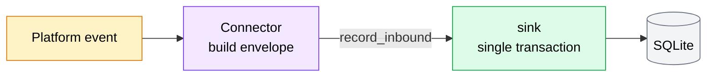

# Connectors — Overview

A **connector** is the single platform-specific component in AMG. Its one job has two directions:

- **Inbound** — turn raw platform events (a new iMessage row, a Discord gateway message) into the normalized [message envelope](../architecture/message-envelope.md) and hand it to the adapter.
- **Outbound** — turn an adapter send request into a concrete platform action (an AppleScript send, a Discord REST call).

Everything *above* the connector — the message sink, SQLite storage, the [REST API](../reference/rest-api.md), and the MCP wrapper — is platform-agnostic. All of the platform knowledge (the Discord SDK, AppleScript, the `chat.db` schema and mach-time quirks) is encapsulated *inside* the connector. That is what lets you add a platform by writing one connector and changing nothing else.

Two connectors ship today: [iMessage](imessage.md) and [Discord](discord.md). This page documents the shared contract they both satisfy; the detailed per-platform mechanics live on their own pages.

!!! info "Adding a new platform"
    Write one connector that produces the normalized envelope inbound and accepts a `send(...)` request outbound. The wrapper, the REST surface, and the storage schema stay unchanged. See the [Architecture overview](../architecture/index.md).

## The connector contract

There is **no shared base class**. A connector is anything that satisfies a structural (duck-typed) protocol that the adapter's lifespan wiring and the `/healthz` registry accept:

```python
from typing import Protocol, Sequence, Any


class SendResult(Protocol):
    ok: bool                  # True on success, False on any failure
    message_id: str | None    # platform-native id on success; None on failure
    error: str | None         # error code when ok is False; None on success
    detail: str | None        # human-readable detail for logs; may be None


class Connector(Protocol):
    # Flipped to True on a *permanent* platform failure (auth revoked,
    # Full Disk Access missing). Read by /healthz; the connector owns it.
    degraded: bool

    async def start(self, *args: Any) -> None:
        """Begin the inbound loop."""

    async def stop(self) -> None:  # iMessage; Discord exposes close()
        """Stop cleanly."""

    async def send(
        self,
        channel_id: str,
        text: str,
        *,
        reply_to: str | None = None,
        attachments: Sequence[Any] | None = None,
    ) -> SendResult:
        """Perform a platform send and report the outcome."""
```

The signatures are real: `degraded` is a plain `bool` attribute the connector sets; `send(...)` returns a frozen `SendResult` dataclass; iMessage exposes `stop()` and Discord exposes `close()` for clean shutdown.

## Lifecycle & conditional start

Connectors are started inside the adapter's FastAPI **lifespan** (`amg/app.py`). Each one starts only when its preconditions are met:

- **Discord** starts only if `AMG_DISCORD_BOT_TOKEN` is set. It runs as an `asyncio` task (`discord_connector.start(token)`).
- **iMessage** starts only on macOS (`sys.platform == "darwin"`) when `~/Library/Messages/chat.db` exists and is readable. A missing path raises `ChatDbPathMissingError` and the connector is skipped.

Each connector that successfully starts registers itself:

```python
healthz.register_connector("discord", discord_connector)
healthz.register_connector("imessage", imessage_connector)
```

On shutdown they are stopped in **reverse** order of start, so in-flight work drains before the engine is disposed.

!!! note "A skipped connector is not an error"
    If a connector's preconditions aren't met it simply never registers, and `/healthz` reports that source as `disabled`. That is the normal state for a Discord-only deployment, or for the adapter running on a non-macOS host.

## Health model

`/healthz` derives a state for each known source (`imessage`, `discord`) purely from the registry and the connector's own `degraded` flag. The route only **reads** the flag — it never mutates connector state.

| State | Condition |
|---|---|
| `disabled` | No connector registered for this source (not configured, or preconditions unmet). |
| `degraded` | Connector registered **and** `connector.degraded == True`. |
| `ok` | Connector registered **and** not degraded. |

Connectors set `degraded = True` themselves on a **permanent** platform failure:

- **iMessage** — the `chat.db` path goes missing, or Full Disk Access is denied.
- **Discord** — a `discord.Forbidden` / `401` on send (a revoked or invalid bot token).

## The inbound handoff

Every connector hands inbound messages to the adapter through the **same** sink method, inside the adapter's single transaction:

```python
await sink.record_inbound(envelope, source=cursor)
```

`source` is the connector's platform-native checkpoint — its resume point:

- **iMessage** — the `chat.db` `ROWID` as a string (e.g. `"4821"`).
- **Discord** — a JSON cursor `{"seq": <int>, "resume_url": <str|null>}`.

Inside that one transaction the sink does all of the platform-agnostic work: it upserts the sender, channel, and attachments; inserts the message; advances `connector_state.cursor` to the supplied checkpoint; and — for allowlisted inbound, when a webhook is configured — enqueues a delivery. See the [Architecture overview](../architecture/index.md) and the [Storage Schema](../architecture/storage.md).



## Outbound routing

The [`POST /messages/send`](../reference/rest-api.md) route picks the connector by inspecting the `channel_id`:

- A `discord:` prefix routes to the **Discord** connector.
- Anything else routes to the **iMessage** connector.

Both connectors return a `SendResult`. The route maps failures onto HTTP errors:

| Connector failure | HTTP response |
|---|---|
| Auth rejected (`401` / `403`, e.g. revoked token) | `502 PLATFORM_AUTH` |
| Any other send failure (no connector configured, channel not found, platform error) | `502 PLATFORM_SEND_FAILED` |

## Per-platform differences at a glance

| Aspect | [iMessage](imessage.md) | [Discord](discord.md) |
|---|---|---|
| Inbound transport | Poll `chat.db` (~1s) | Gateway WebSocket (push) |
| Outbound transport | AppleScript via `osascript` | Discord REST |
| `channel_id` format | E.164 / email, no prefix | `discord:dm:<id>` / `discord:channel:<id>` |
| Inbound cursor | `ROWID` string | `{"seq": …, "resume_url": …}` JSON |
| Inbound attachments | Re-hosted by the adapter | Not yet implemented |

For the full mechanics — polling and `attributedBody` decoding on iMessage, gateway resume and intents on Discord — see the [iMessage](imessage.md) and [Discord](discord.md) pages.
