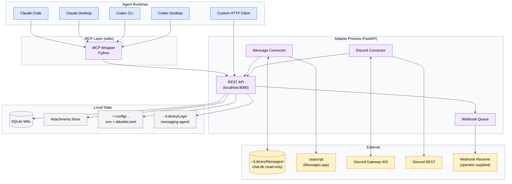

# Agent Messaging Channel

AMC is a personal-scale messaging gateway that exposes the same four-tool MCP surface — and an equivalent REST surface — over both **iMessage** and **Discord**, normalizing their very different I/O models behind a single message envelope. v1 ships as a Python + FastAPI adapter on macOS, supervised by `launchd`, with a thin Python MCP wrapper for stdio clients (Claude Code, Claude Desktop, Codex CLI/Desktop) and a documented direct-HTTP path for non-MCP consumers. It is decoupled by design: swapping the agent framework, the MCP wrapper, or either connector requires no changes to the other layers.

!!! note "One agent, two platforms"
    AMC normalizes iMessage and Discord so an agent works the same way on both: see what's new, look up context, reply, mark done. Adding a third platform means writing one connector that emits the standard envelope — nothing upstream changes.

## Architecture



## The three layers

AMC is built as three independently replaceable layers. See the [Architecture overview](architecture/index.md) for the full design.

- **Adapter HTTP API** — the source of truth. A single FastAPI process runs both connectors as background tasks, persists every message to SQLite, and exposes the [REST API](reference/rest-api.md) plus an outbound webhook for new inbound messages. Agents that don't speak MCP hit this directly.
- **MCP Wrapper** — a thin FastMCP layer (Python) that translates the four [MCP tools](reference/mcp-tools.md) into HTTP calls against the adapter. It contains **no platform-specific code**; that boundary is statically enforced.
- **Connectors** — one per platform. The [iMessage connector](connectors/imessage.md) polls `chat.db` and sends via AppleScript; the [Discord connector](connectors/discord.md) uses a Gateway WebSocket plus REST. Both emit the same [message envelope](architecture/message-envelope.md).

## Documentation map

| Section | What you'll find |
| --- | --- |
| [Getting Started](getting-started/index.md) | Full operator setup: macOS permissions, Discord bot, allowlist, first run. |
| [Architecture: Overview](architecture/index.md) | How the three layers fit together and why they're decoupled. |
| [Architecture: Message Envelope](architecture/message-envelope.md) | The normalized JSON shape every message conforms to. |
| [Architecture: Storage Schema](architecture/storage.md) | SQLite tables — `messages`, `channels`, `senders`, `identity_links`, and more. |
| [Connectors: Overview](connectors/index.md) | The connector contract and shared inbound sink path. |
| [Connectors: iMessage](connectors/imessage.md) | `chat.db` polling, `attributedBody` decoding, AppleScript send. |
| [Connectors: Discord](connectors/discord.md) | Gateway WebSocket intake plus REST send. |
| [Reference: REST API](reference/rest-api.md) | Endpoints, request/response shapes, error codes. |
| [Reference: MCP Tools](reference/mcp-tools.md) | The four tools and their arguments. |
| [Reference: Configuration](reference/configuration.md) | Environment variables, `.env`, and `allowlist.toml`. |
| [Reference: amc CLI](reference/cli.md) | `serve`, `install`, `service`, `status`, `logs`, `doctor`. |
| [Operations: Overview](operations/index.md) | Running AMC under `launchd` on a single Mac. |
| [Operations: Runbook](operations/runbook.md) | Day-2 tasks, permission prompts, recovery procedures. |
| [Operations: Webhook Receiver](operations/webhook-receiver.md) | Bridging outbound webhooks to one-shot agent invocations. |

## Quick start

```bash
# Install the adapter, MCP wrapper, and webhook receiver
uv sync --all-packages

# Create / migrate the SQLite database
uv run alembic upgrade head

# Run the adapter in the foreground (localhost:8080)
amc serve adapter
```

!!! tip "This is only the local-process part"
    The snippet above gets the adapter running, but a working install also needs Full Disk Access for `chat.db`, the Messages Automation prompt, a Discord bot token, and a channel allowlist. Walk through all of it in [Getting Started](getting-started/index.md).

## Status

Pre-v1, in active build — v1 acceptance is gated by an automated test suite: a bounded stability run, webhook delivery at >=95% on first attempt, crash-and-relaunch survival, and a passing docs-lint.
