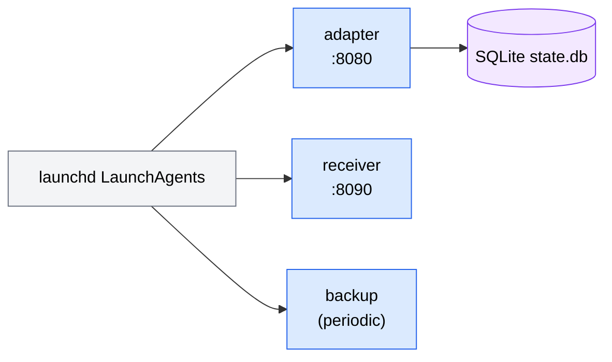

# Operations — Overview

This page orients an operator to running AMC in production on a single Mac. It is a hub: the deep procedures live in the [Runbook](runbook.md), and the full first-time walkthrough (macOS permissions, Discord bot, channel allowlist) lives in the [Setup Guide](../getting-started/index.md).

!!! note "Scope"
    AMC is a personal-scale, single-Mac service. Everything below assumes one operator running the adapter under their own login session — not a multi-tenant or cluster deployment.

## Deployment shape

AMC runs as per-user `launchd` **LaunchAgents** on one Mac. There are three services, all managed through the [amc CLI](../reference/cli.md):

| Service | What it is | Port | Notes |
| --- | --- | --- | --- |
| `adapter` | The FastAPI app plus both connectors | 8080 | The source of truth; always required. |
| `receiver` | The optional [webhook receiver](webhook-receiver.md) | 8090 | Only if you bridge inbound messages to an agent. |
| `backup` | A periodic SQLite backup job | — | launchd-only; no listening port. |



Install all three and verify:

```bash
amc install        # render plists + bootstrap launchd services
amc status         # is each service loaded and running?
amc doctor         # environment, permissions, and config sanity checks
```

!!! tip "First-time setup is more than install"
    `amc install` wires up the services, but a working install also needs Full Disk Access for `chat.db`, the Messages Automation prompt, a Discord bot token, and a channel allowlist. Walk through all of it in the [Setup Guide](../getting-started/index.md).

## Where state lives

| What | Path | Override / reference |
| --- | --- | --- |
| Database | `~/Library/Application Support/messaging-agent/state.db` | `AMC_DB_PATH` — see [Storage Schema](../architecture/storage.md). |
| Attachments | `~/Library/Application Support/messaging-agent/attachments` | `AMC_ATTACHMENT_DIR`. |
| Logs | `~/Library/Logs/messaging-agent/` | Daily-rotated structured JSON, e.g. `adapter-YYYY-MM-DD.log`. |
| Config | `~/.config/messaging-agent/.env` and `allowlist.toml` | Both `chmod 0600` — see [Configuration](../reference/configuration.md). |

## launchd restart policy

The adapter plist is configured so the service survives login, reboot, and crashes without operator intervention:

- `RunAtLoad=true` — start at login / boot.
- `KeepAlive={SuccessfulExit:false}` — restart on a crash, but not on a clean exit.
- `ThrottleInterval=10` — at least 10 seconds between respawns.

Together these meet the spec's RTO target of **≤5 minutes** to recover after a crash.

!!! important "Config lives in `.env`, not the plist"
    The plist's `EnvironmentVariables` is intentionally empty — all configuration belongs in `~/.config/messaging-agent/.env`. As a result, a config change only needs a restart, never a reinstall:

    ```bash
    amc service restart adapter
    ```

## Keeping the Mac awake

When the Mac sleeps, the iMessage poller is suspended and stops processing new messages. This only matters when the iMessage connector is in use. Pick one of:

- Run under `caffeinate`:

    ```bash
    caffeinate -dimsu -- amc serve adapter
    ```

- Or, in System Settings → Energy / Battery, enable **Prevent automatic sleeping when the display is off** plus **Wake for network access**.

Verify the assertion is in place:

```bash
pmset -g assertions
```

## Updates and rollback

The documented update path:

```bash
cd <install dir>
git pull
uv sync --all-packages
uv run alembic upgrade head
amc service restart adapter
```

!!! note "When to re-run `amc install`"
    Re-run `amc install` **only** if a plist template under `ops/launchd/` changed. A code or config update does not need it — a `service restart` is enough.

To roll back a bad release:

```bash
uv run alembic downgrade -1   # only if a migration is at fault
git checkout <prev-sha>
uv sync --all-packages
amc service restart adapter
```

## Observability quick hits

```bash
amc status                                          # loaded / running state per service
amc doctor                                          # environment + permission checks
amc logs adapter                                    # tail the structured JSON logs
curl -sS http://127.0.0.1:8080/healthz | jq .       # health probe (needs the bearer header)
```

!!! warning "`/healthz` is authenticated"
    The health endpoint requires the bearer header, the same as every other adapter route. An unauthenticated `curl` returns `401`, which is not an outage.

For failure diagnosis and step-by-step recovery, go straight to the [Runbook](runbook.md).

## Operational map

- [Runbook](runbook.md) — failure modes and recovery procedures (the deep, day-2 reference).
- [Webhook Receiver](webhook-receiver.md) — the push-to-agent bridge that turns inbound messages into one-shot agent invocations.
- [amc CLI](../reference/cli.md) — `serve`, `install`, `service`, `status`, `logs`, `doctor`.
- [Configuration](../reference/configuration.md) — environment variables, `.env`, and `allowlist.toml`.
