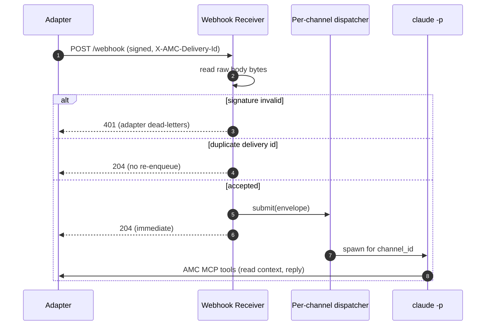

# Webhook Receiver

The **webhook receiver** (`webhook-receiver/`, package `amc_receiver`) is a
separate, optional service that bridges the adapter's outbound webhooks to
one-shot `claude -p` invocations. With it running, an inbound message can
trigger an agent run **without any polling** — the agent wakes only when a
real message arrives, decides whether and how to reply, and exits.

It is the *push* half of the inbound path described in the
[Architecture overview](index.md)'s data flow.

!!! note "It does not replace the adapter"
    The adapter remains the source of truth: it persists messages, owns the
    REST and MCP surfaces, and owns webhook **retry/backoff**. The receiver
    only accepts (`204`) or rejects (`401`) a single delivery — it never
    retries deliveries itself.

## What it is and why

Without the receiver, an agent learns about new messages by polling
`GET /messages/unread` on a timer. That works, but it is either laggy (long
poll interval) or wasteful (tight poll interval), and the agent process must
stay alive between checks.

With the receiver, the adapter **pushes** each allowlisted inbound message to
the receiver as an HMAC-signed `POST`. The receiver verifies the signature,
dedupes the delivery, and spawns a fresh `claude -p` to handle that one
message. No long-lived agent process, no polling loop.

## Endpoint and request flow

The receiver exposes exactly two endpoints:

- `POST /webhook` — accepts one signed delivery from the adapter.
- `GET /healthz` — liveness probe; reports the active per-channel worker count.

Each delivery carries these headers:

```http
POST /webhook HTTP/1.1
Content-Type: application/json
X-AMC-Signature: sha256=<hex-hmac-of-raw-body>
X-AMC-Delivery-Id: <uuid>
```

The handler processes a delivery in this order:

1. **Read the raw body bytes.** The handler calls `await request.body()`
   *before* any JSON parse. The HMAC is computed over the exact wire bytes,
   so re-serializing the JSON would change them and break verification.
2. **Verify the signature.** `X-AMC-Signature: sha256=<hex>` is checked with a
   constant-time HMAC-SHA256 over the raw body using `AMC_WEBHOOK_SECRET`. On
   mismatch the receiver returns `401`.
3. **Dedupe on `X-AMC-Delivery-Id`** using a bounded LRU. An already-seen
   delivery returns `204` immediately and is **not** re-enqueued.
4. **Parse the envelope JSON** and submit it to the per-channel dispatcher.
5. **Return `204` immediately** — the handler does not wait for Claude.
   Downstream processing errors (Claude crash, MCP timeout) are logged, not
   surfaced back to the adapter, because they are not transport errors and the
   delivery was already accepted.

!!! warning "A `401` is permanent, not transient"
    A signature mismatch causes the adapter to **dead-letter** the delivery
    rather than retry it — signature failures are permanent by definition. The
    most common cause is a secret mismatch between the two services (see the
    configuration warning below). The dead-letter scenario is covered in the
    [Runbook](runbook.md).



## Concurrency model

Ordering is **per channel**:

- Messages from the **same** `channel_id` are processed strictly in arrival
  order — at most one Claude invocation runs per channel at a time.
- Different channels run **in parallel**, each with its own async worker.
- A per-channel worker is **evicted after an idle TTL**
  (`AMC_RECEIVER_IDLE_WORKER_TTL_SECONDS`, default 300s) so idle channels do
  not accumulate.

This keeps a single conversation coherent (no two replies racing) while still
letting unrelated conversations make progress concurrently.

## How it invokes Claude

For each accepted message the receiver spawns `claude -p` asynchronously,
with the working directory set to a bundled workspace so Claude auto-discovers
its MCP and settings files. The invocation is assembled from:

- **System prompt** — loaded from `~/.config/messaging-agent/agent_prompt.md`
  (override with `AMC_RECEIVER_AGENT_PROMPT_FILE`), falling back to a bundled
  default. The file is re-read on every invocation, so prompt edits take
  effect without restarting the service.
- **`--mcp-config`** — points at the AMC MCP wrapper, invoked as
  `<python> -m amc_mcp` from this venv (so PATH resolution under launchd is not
  a concern). The wrapper receives `AMC_BEARER_TOKEN`, `AMC_AGENT_ID`, and
  `AMC_BASE_URL` via this config.
- **`--strict-mcp-config`** — so the operator's global `~/.claude.json` MCP
  servers do not leak into the session.
- **`--setting-sources project,local`** — so user-global settings and
  permission grants do not leak in either.
- **`--allowedTools`** — limited to the four AMC MCP tools
  (`list_unread_messages`, `send_message`, `mark_read`, `get_message_context`).
  When `AMC_RECEIVER_DANGEROUS=1`, this is replaced by
  `--dangerously-skip-permissions` for unattended runs.
- **stdin** — the normalized envelope JSON, piped in with a brief preamble.

The agent then uses the [MCP tools](../reference/mcp-tools.md) to read context
and reply. Each delivery carries one [Message Envelope](../architecture/message-envelope.md);
the `id` and `channel_id` fields are what the agent passes to those tools.

## Configuration

The full table lives on the [Configuration](../reference/configuration.md)
page. The receiver requires two variables and accepts several optional ones.

**Required:**

| Variable | Notes |
| --- | --- |
| `AMC_WEBHOOK_SECRET` | Shared HMAC secret — **must match the adapter's**. |
| `AMC_BEARER_TOKEN` | Adapter bearer token, passed through to the MCP wrapper. |

**Notable optional (defaults shown):**

| Variable | Default | Notes |
| --- | --- | --- |
| `AMC_RECEIVER_BIND_HOST` | `127.0.0.1` | Bind interface. |
| `AMC_RECEIVER_BIND_PORT` | `8090` | Bind port. |
| `AMC_AGENT_ID` | `amc-receiver` | Per-agent cursor identity for the MCP wrapper. |
| `AMC_RECEIVER_AGENT_PROMPT_FILE` | `~/.config/messaging-agent/agent_prompt.md` | System prompt source. |
| `AMC_RECEIVER_DANGEROUS` | `0` | `1` swaps in `--dangerously-skip-permissions`. |
| `AMC_RECEIVER_CLAUDE_TIMEOUT_SECONDS` | `300` | Per-message wall-clock budget. |
| `AMC_RECEIVER_CLAUDE_BIN` | `claude` | Path to the `claude` binary. |
| `AMC_BASE_URL` | `http://127.0.0.1:8080` | Adapter HTTP base for the MCP wrapper. |

!!! danger "Secrets must match exactly"
    The receiver's `AMC_WEBHOOK_SECRET` must **exactly** match the adapter's.
    If they differ, every delivery fails signature verification, returns
    `401`, and is dead-lettered by the adapter — so no messages reach the
    agent at all.

## Running it

For local development, run the receiver in the foreground:

```bash
uv run --project webhook-receiver \
    uvicorn amc_receiver.app:app --host 127.0.0.1 --port 8090
```

Equivalent shortcuts:

```bash
# Console script (installed by `uv sync --all-packages`)
amc-webhook-receiver

# Operator CLI
amc serve receiver
```

In production the receiver runs as the launchd `receiver` service managed by
the [amc CLI](../reference/cli.md):

```bash
amc install receiver
amc service start receiver
```

### Enabling push on the adapter

The receiver only does anything if the **adapter** is configured to push to
it. On the adapter side, set `AMC_WEBHOOK_URL` (and the matching
`AMC_WEBHOOK_SECRET`) to point at this receiver, typically in
`~/.config/messaging-agent/.env`:

```bash
AMC_WEBHOOK_URL=http://127.0.0.1:8090/webhook
AMC_WEBHOOK_SECRET=<same secret the receiver uses>
```

The adapter picks this up on restart; no code change is needed.

## Internal modules

| Module | Responsibility |
| --- | --- |
| `app.py` | FastAPI app exposing `POST /webhook` and `GET /healthz`; orchestrates verify → dedupe → submit → `204`. |
| `auth.py` | HMAC-SHA256 compute and constant-time verify over raw body bytes. |
| `dispatcher.py` | Per-channel async workers (in-order per channel, parallel across channels) plus the delivery-id dedupe LRU. |
| `claude_runner.py` | Subprocess wrapper that builds and runs the `claude -p` invocation. |
| `config.py` | `ReceiverConfig.from_env()` — env parsing and validation. |
| `logging.py` | Structured (structlog) logging configuration. |

## See also

- [Operations overview](index.md) — where the receiver fits in the data flow.
- [Runbook](runbook.md) — the webhook dead-lettering scenario and recovery.
- [Configuration](../reference/configuration.md) — the full env-var reference.
