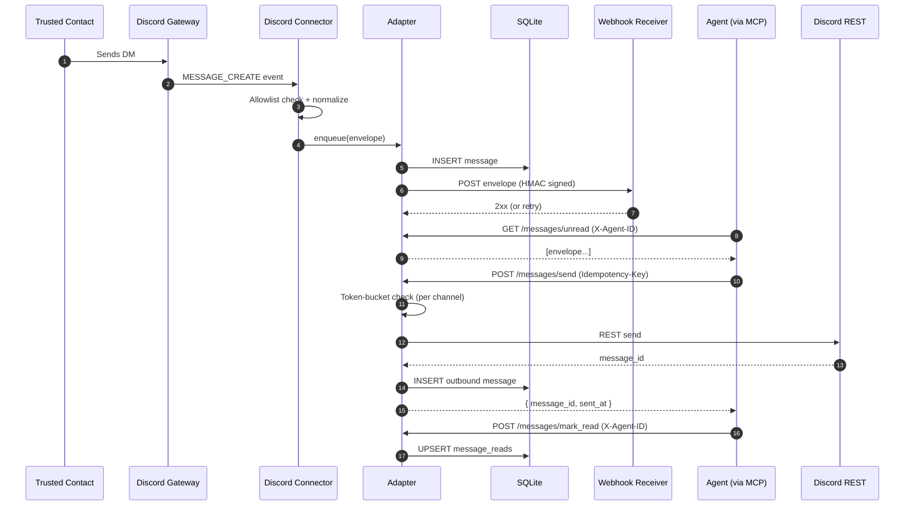
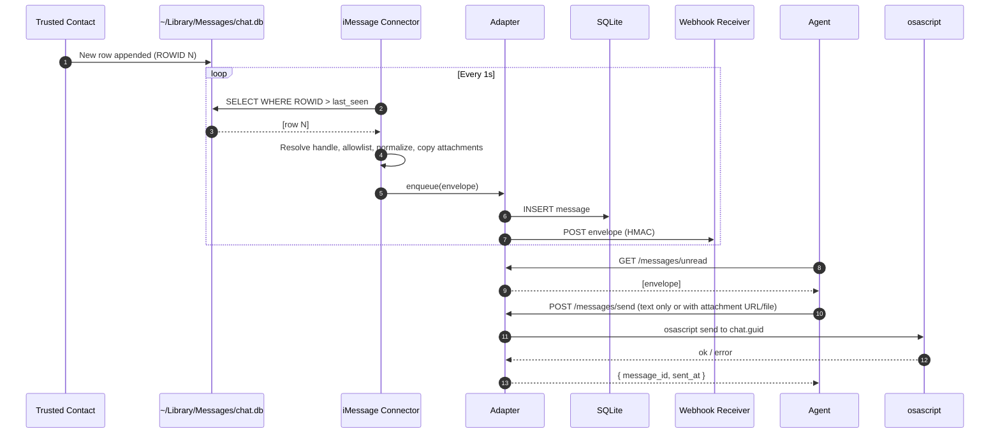
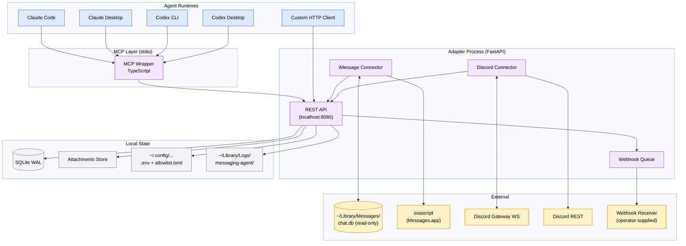
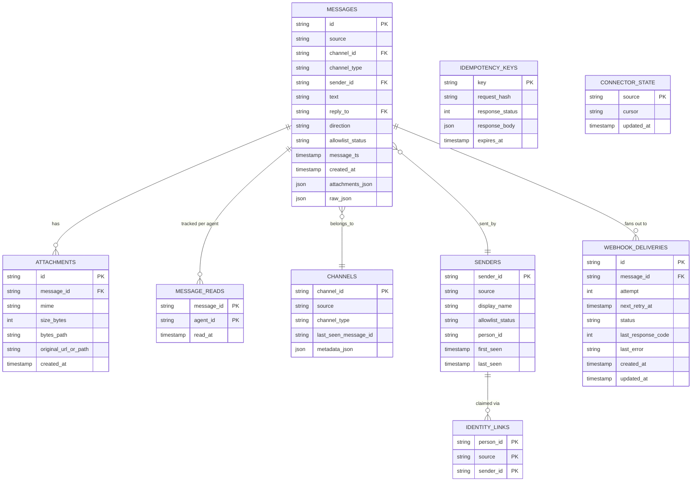
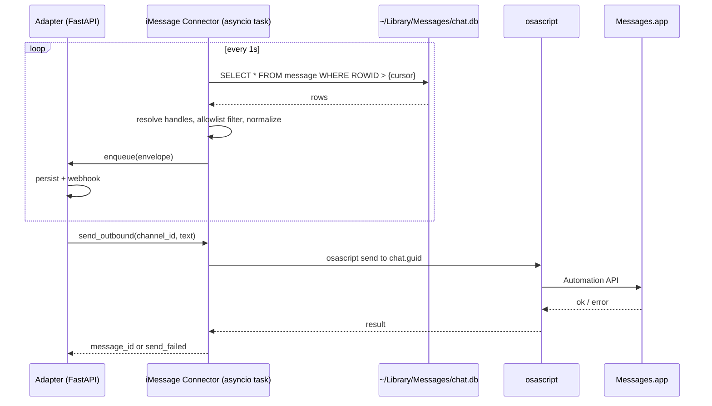
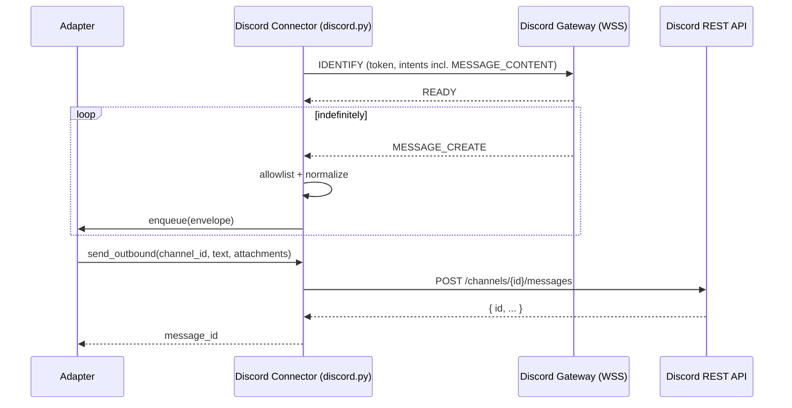

# Agent Messaging Channel PRD

**Version**: 1.0
**Author**: Stephen Sequenzia
**Date**: 2026-05-02
**Status**: Draft
**Spec Type**: New product
**Spec Depth**: Full technical documentation
**Description**: A single-Mac service that lets one AI agent send and receive messages on iMessage and Discord through a unified interface. The design priority is decoupling: the agent framework, the transport, and the platform connectors must each be replaceable without rewriting the others. Agents reach the system over MCP (stdio) or directly over plain HTTP. Source of truth is the blueprint at `internal/blueprints/agent-messaging-channel.md`, which this spec extends and, in two specific places, supersedes.

---

## 1. Executive Summary

The Agent Messaging Channel (AMC) is a personal-scale messaging gateway that exposes the same four-tool MCP surface (and an equivalent REST surface) over both iMessage and Discord, normalizing their very different I/O models behind a single message envelope. v1 ships as a Python+FastAPI adapter on macOS, supervised by `launchd`, with a thin TypeScript MCP wrapper for stdio-based clients (Claude Code, Claude Desktop, Codex CLI, Codex Desktop) and a documented direct-HTTP path for non-MCP consumers. The system is built decoupled-by-design so that swapping the agent framework, the MCP wrapper, or either connector requires no changes to the other layers.

## 2. Problem Statement

### 2.1 The Problem

A single owner wants one AI agent to be reachable on the messaging platforms they (and a small trusted circle) already use — iMessage and Discord — without locking the agent into either a specific platform SDK or a specific agent framework. Today, every agent framework, channel SDK, and message bus combination is a fresh integration; rewriting platform code each time the agent framework changes (or vice versa) is not a sustainable path for a personal-scale tool.

### 2.2 Current State

There is no implementation yet. The repository contains only this PRD's source (the blueprint), README, and Claude Code config. Existing reference work that AMC will build on:

- **iMessage**: `anthropics/claude-plugins-official/external_plugins/imessage` — `chat.db` polling and AppleScript send patterns.
- **Discord**: `discord.py` (and the equivalent Anthropic Discord plugin as reference, not a dependency).
- **MCP**: `@modelcontextprotocol/sdk` (TypeScript) for the wrapper.

Manual interaction with each platform — opening Messages.app, opening Discord — is the current human flow. Automation would otherwise require either a custom per-platform integration per agent framework, or coupling the agent to a single proprietary channel SDK.

### 2.3 Impact Analysis

This is a personal-tool project; "impact" is measured against the owner's experience and the architectural goals, not commercial metrics:

- **Without AMC**: every new agent framework explored (Claude Code, Claude Desktop, Codex CLI, Codex Desktop, custom Python loops) requires re-integrating either iMessage or Discord — N×M coupling.
- **With AMC**: one adapter, one MCP wrapper, two connectors. Adding a third platform (Slack, SMS, Telegram) is a single connector. Adding a third agent framework is zero adapter changes.

### 2.4 Business Value

- Validates a **decoupled three-layer architecture** as a working pattern, not a sketch.
- Produces a **portable tool** that survives churn in MCP, agent SDKs, and platform APIs.
- Yields **reusable artifacts** — the message envelope shape, the per-agent cursor schema, and the webhook delivery contract — that future projects can adopt.

## 3. Goals & Success Metrics

### 3.1 Primary Goals

1. **Receive and respond** to messages on iMessage and Discord through a single agent in v1.
2. **Decouple platform integrations from agent logic** so the agent framework can be swapped without rewriting connectors. Both MCP-aware (Claude Code, Claude Desktop, Codex CLI, Codex Desktop) and non-MCP (direct-HTTP) clients are first-class.
3. **Run entirely on one Mac**, with no external hosting dependencies for the iMessage path.
4. **Ship a documented, soak-validated v1** that a teammate could install and run without the owner present.

### 3.2 Success Metrics

| Metric | Current Baseline | Target | Measurement Method | Timeline |
|--------|------------------|--------|--------------------|----------|
| Round-trip both platforms via MCP wrapper | Not implemented | Confirmed: 1 real iMessage exchange + 1 real Discord exchange end-to-end | Manual e2e during Phase 3 acceptance | End of Phase 3 |
| Soak duration without manual intervention | N/A | ≥ 7 consecutive days | launchd uptime + structured log review | Phase 4 |
| Receive → agent-visible latency (P95) | N/A | < 3 s | Compare envelope `timestamp` to `created_at` in DB; query log on representative sample | Phase 4 |
| Send → platform-acked latency (P95) | N/A | < 2 s | `/messages/send` request duration in adapter logs | Phase 4 |
| Webhook delivery success rate (first attempt) | N/A | ≥ 95% under normal conditions | `webhook_deliveries` table aggregate | Phase 4 |
| Setup repeatability | N/A | A teammate completes setup from `SETUP.md` in ≤ 60 minutes | One witnessed install attempt | Phase 4 |
| Schema-divergence-from-blueprint tracked | Partial | All v1 divergences updated in blueprint | Diff blueprint vs. spec; resolve | End of Phase 1 |

### 3.3 Non-Goals

- Multi-host / multi-Mac deployment.
- Cloud or hosted-service operation (the iMessage path is impossible off the Mac).
- Group chat support on iMessage (deferred to post-v1).
- Reactions / tapbacks / message edits / deletes (deferred to post-v1; surfaced only in `raw` field).
- HTTP MCP transport for remote agents (deferred to post-v1; v1 ships stdio-only).
- Multi-agent leasing / contention model (per-agent cursors are sufficient for v1).
- Any non-bearer authentication (OAuth, mTLS) on the adapter REST API.
- Production SLAs, paging, on-call (this is a personal tool).

## 4. User Research

### 4.1 Target Users

#### Primary Persona: The Owner-Operator

- **Role/Description**: Single human who owns the Mac, the Apple ID, and the Discord bot. Both author and primary user of the system.
- **Goals**: Have one AI agent reachable on both iMessage and Discord; experiment with multiple agent frameworks without re-doing channel work; eventually delegate routine messaging to the agent.
- **Pain Points**: Today, no single agent framework speaks both platforms cleanly. Cross-platform identity is muddy. Setup of platform-side credentials (Discord intents, iMessage permissions) is undocumented and error-prone.
- **Context**: macOS workstation, technically fluent (Python + TypeScript), prefers `ruff` / `uv` / `pytest` per global standards.
- **Technical Proficiency**: High.

#### Secondary Persona: The Trusted Circle (5–10 humans)

- **Role/Description**: Friends, family, or close collaborators who message the owner via iMessage DMs or Discord DMs / specific server channels. They are subjects of, not operators of, the system.
- **Goals**: Reach the owner. Get an answer. Don't necessarily know they are talking to an agent vs. the owner.
- **Pain Points**: None imposed by AMC; they should not perceive the system except via response latency.
- **Context**: Whatever device they normally message from.
- **Technical Proficiency**: Irrelevant — they never touch AMC directly.

### 4.2 User Journey Map

```mermaid
flowchart LR
    A["Trusted contact composes<br/>message in Messages or Discord"]:::neutral --> B["Platform delivers to Mac"]:::primary
    B --> C["Connector normalizes<br/>to envelope"]:::secondary
    C --> D["Adapter persists<br/>+ webhook fires"]:::secondary
    D --> E["Agent reads via MCP<br/>or webhook"]:::primary
    E --> F["Agent calls send_message"]:::secondary
    F --> G["Reply delivered<br/>back to contact"]:::success

    classDef primary fill:#dbeafe,stroke:#2563eb,color:#000
    classDef secondary fill:#f3e8ff,stroke:#7c3aed,color:#000
    classDef success fill:#dcfce7,stroke:#16a34a,color:#000
    classDef neutral fill:#f3f4f6,stroke:#6b7280,color:#000
```



### 4.3 User Workflows

#### Workflow 1: Inbound message (Discord DM, agent reply)



#### Workflow 2: Inbound message (iMessage DM, polling path)



## 5. Functional Requirements

The numbering uses `REQ-AMC-NNN`. Priorities: P0 (must ship in v1), P1 (must ship in v1, lower urgency), P2 (post-v1).

---

### 5.1 Feature: Inbound message ingestion (REQ-AMC-001)

**Priority**: P0 (Critical)
**Complexity**: High

#### User Stories

**US-001**: As the Owner-Operator, I want every message sent to me on iMessage or Discord by an allowlisted contact to become visible to my agent within seconds, so that the agent can respond without my involvement.

**Acceptance Criteria**:
- [ ] iMessage DMs from allowlisted handles appear in `/messages/unread` within P95 < 3s of arrival in `chat.db`.
- [ ] Discord DMs and configured server-channel messages from allowlisted user IDs appear in `/messages/unread` within P95 < 3s of `MESSAGE_CREATE`.
- [ ] Inbound messages from non-allowlisted senders are stored with `allowlist_status='unknown'` and **never** appear in `/messages/unread`; they are reachable only via `/messages/quarantine`.
- [ ] Every inbound message conforms to the normalized envelope (see §7.3.1).
- [ ] Polling state survives restart (last seen `ROWID` for iMessage; gateway resume token for Discord).
- [ ] Connectors detect Mac wake (gap in ROWID / heartbeat) and resume cleanly without duplicates.

**Technical Notes**:
- iMessage poller uses `aiosqlite` or sync `sqlite3` on a thread executor; never blocks the event loop.
- chat.db is opened **read-only** (`mode=ro` URI + `PRAGMA query_only=ON`).
- Discord connector sets the **Message Content intent** explicitly.
- Each connector's "last seen" cursor lives in a row of the adapter's `connector_state` table, updated transactionally with the message INSERT.

**Edge Cases**:
| Scenario | Input | Expected Behavior |
|----------|-------|-------------------|
| Allowlisted contact sends a long thread of 50 messages while adapter is restarting | 50 unprocessed rows in `chat.db` | On restart, all 50 are normalized in order (ASC by `ROWID`) and inserted; webhook fires for each |
| Discord gateway disconnects mid-conversation | Gateway WS close | Library-level reconnect with backoff; resume from last sequence ID; missed messages are pulled via REST replay if supported, else accepted as a soft gap |
| Same contact messages on both platforms | iMessage + Discord, same `person_id` in allowlist | Both envelopes appear in `/messages/unread`; `identity_links` rows associate them with shared `person_id` |
| iMessage attachment is a 50 MB video | chat.db row with attachment | Adapter copies binary into local store under attachment retention (90 days); envelope `attachments[].url` resolves to `/attachments/{id}` |
| Mac sleeps for 6 hours | iMessage missed during sleep | On wake, poller detects ROWID jump, pulls all missed rows, fires webhooks in order |
| Receiver-of-webhook is down | Adapter fires webhook | Retries per §6.4 retry policy; on dead-letter, message remains visible in `/messages/unread` |

**Error Handling**:
| Error Condition | User Message | System Action |
|-----------------|--------------|---------------|
| chat.db read fails (FDA not granted) | N/A — startup error | Adapter logs `ERROR component=imessage_connector reason=fda_missing` and refuses to mark Phase 2 ready; emits non-zero exit if `--require-imessage` is set |
| Discord gateway permanent failure (token revoked) | N/A | Connector logs `ERROR`, marks itself `degraded` in `/healthz`, stops retrying after 5 minutes |
| Allowlist file missing or malformed | N/A | Adapter refuses to start; clear error printed to stderr referencing the file path |

---

### 5.2 Feature: Outbound message sending (REQ-AMC-002)

**Priority**: P0 (Critical)
**Complexity**: Medium

#### User Stories

**US-002**: As the agent, I want to send a reply to a specific channel — optionally as a thread reply, optionally with an attachment — and receive a stable message ID back, so that I can record the reply and idempotently retry on failure.

**Acceptance Criteria**:
- [ ] `POST /messages/send` accepts `channel_id`, `text`, optional `reply_to`, optional `attachments[].url` (adapter-hosted) or `attachments[].path` (local file).
- [ ] Send completes within P95 < 2 s (platform ack to caller response).
- [ ] An `Idempotency-Key` header (UUID) caches the response for 24 h; duplicate keys return the original response without re-sending.
- [ ] Token-bucket rate limit (default 1 msg/s sustained, burst 5, per `channel_id`) enforced; over-limit returns `429` with `Retry-After`.
- [ ] iMessage send: 3 retries with backoff before marking `send_failed`.
- [ ] Discord send: respects discord.py rate-limit handling; 5xx retried with backoff.
- [ ] Outbound messages are persisted in the same `messages` table with `direction='outbound'` (or equivalent flag) so context-replay sees the agent's own messages.

**Technical Notes**:
- AppleScript send invoked via `subprocess` in `asyncio.to_thread()` — never blocks the loop.
- Idempotency-Key storage in `idempotency_keys` table; opaque hash of request body to detect a colliding key with a different body (return 422).
- Attachment outbound: connector uploads from local file or fetches the `/attachments/{id}` URL by path (skipping HTTP).

**Edge Cases**:
| Scenario | Input | Expected Behavior |
|----------|-------|-------------------|
| Agent retries with same `Idempotency-Key` after a successful send | Duplicate POST | Returns the original `{message_id, sent_at}` with header `Idempotency-Replayed: true` |
| Agent retries with same key but different body | Duplicate key, different `text` | Returns `422 Unprocessable Entity` with `code=IDEMPOTENCY_KEY_REUSE` |
| Send to non-allowlisted channel | New `channel_id` not seen before | Allowed; allowlist gates *inbound*, not outbound. Adapter logs the new channel |
| AppleScript times out | osascript hangs > 10 s | Killed, retried up to 3 times, then `send_failed` |
| Token bucket exhausted | 6th send to same channel within burst window | `429 Too Many Requests`, `Retry-After: <seconds>` |

**Error Handling**:
| Error Condition | User Message | System Action |
|-----------------|--------------|---------------|
| Discord 401 (bot token bad) | `{"error":{"code":"PLATFORM_AUTH","message":"Discord bot token rejected"}}` | Mark connector degraded; do not retry until config reload |
| iMessage send_failed after retries | `{"error":{"code":"SEND_FAILED","message":"AppleScript send failed after 3 attempts"}}` | Persist outbound row with `status='send_failed'`; surface in admin endpoint |
| Channel not found | `404` with `code=CHANNEL_NOT_FOUND` | No retry |

---

### 5.3 Feature: Read state per agent (REQ-AMC-003)

**Priority**: P0 (Critical)
**Complexity**: Medium

#### User Stories

**US-003**: As an operator running multiple MCP clients (Claude Code + Codex CLI + a custom Python loop) against the same adapter, I want each client to have its own "unread" view, so that one client doesn't silently consume messages another client should have seen.

**Acceptance Criteria**:
- [ ] Every read endpoint (`GET /messages/unread`, `POST /messages/mark_read`) requires header `X-Agent-ID: <name>`.
- [ ] `/messages/unread` returns messages where no row exists in `message_reads` for the requesting `agent_id`.
- [ ] `mark_read` UPSERTs `(message_id, agent_id, read_at)` rows; idempotent.
- [ ] `next_since` cursor returned by `/messages/unread` is per-agent (largest `timestamp` returned).
- [ ] Two agents reading the same allowlisted message both see it as unread until each calls `mark_read`.

**Technical Notes**:
- This is a deliberate divergence from blueprint §5.3 (which placed `read_at` on `messages`). Blueprint will be updated as part of Phase 1.

**Edge Cases**:
| Scenario | Input | Expected Behavior |
|----------|-------|-------------------|
| Agent A marks message X read; agent B queries unread | A: `mark_read([X])`; B: `GET /messages/unread` | B still sees X |
| Same agent marks same message read twice | Two `mark_read` calls with same `[X]` | UPSERT is a no-op on second call; both return `marked_count: 1` (count of rows added in *this* call may be 0 — exact semantics TBD in §14 OQ-1) |
| Agent ID missing | `GET /messages/unread` without header | `400` with `code=AGENT_ID_REQUIRED` |

---

### 5.4 Feature: Message context fetch (REQ-AMC-004)

**Priority**: P0 (Critical)
**Complexity**: Low

#### User Stories

**US-004**: As the agent, I want to fetch the N messages before and after a target message in a channel, so that I can reason about a thread without dumping the entire channel history.

**Acceptance Criteria**:
- [ ] `GET /messages/context?channel_id=&around_message_id=&before=&after=` returns messages in chronological order.
- [ ] Defaults: `before=5`, `after=5`. Caps: `before<=50`, `after<=50`.
- [ ] Includes both inbound and outbound messages.
- [ ] Excludes messages from non-allowlisted senders (consistent with `/messages/unread`).

**Edge Cases**:
| Scenario | Input | Expected Behavior |
|----------|-------|-------------------|
| Target message not found | unknown `around_message_id` | `404` with `code=MESSAGE_NOT_FOUND` |
| Target message is in quarantine (non-allowlisted sender) | quarantined ID | `404` (treated as not visible to this surface) |
| Channel has fewer than `before` messages older than target | early conversation | Returns whatever is available; no padding |

---

### 5.5 Feature: Outbound webhook for new messages (REQ-AMC-005)

**Priority**: P0 (Critical)
**Complexity**: Medium

#### User Stories

**US-005**: As an event-driven consumer (n8n, custom script), I want to receive a POST containing the normalized envelope every time a new allowlisted message arrives, so that I can react without polling.

**Acceptance Criteria**:
- [ ] Adapter POSTs the envelope JSON body to a configured webhook URL on every new **allowlisted** inbound message.
- [ ] Header `X-AMC-Signature: sha256=<hex>` carries an HMAC of the raw body using a shared secret from `.env`.
- [ ] Header `X-AMC-Delivery-Id: <uuid>` is unique per delivery attempt for idempotent receivers.
- [ ] Header `X-AMC-Message-Id: <id>` mirrors `envelope.id`.
- [ ] Retry on 5xx / network failure / non-2xx (except 4xx, which dead-letters immediately): 5 attempts at ~1s, 5s, 30s, 2m, 10m.
- [ ] After 5 failed attempts, row in `webhook_deliveries` set to `status='dead'`; the underlying message remains in `/messages/unread` (poll-based recovery).
- [ ] Delivery state survives adapter restart (queue is DB-backed).
- [ ] Webhook URL is **not** required; if unset, no webhook fires and no `webhook_deliveries` rows are created.

**Technical Notes**:
- Signature is computed over the **exact bytes** of the request body, before any framework reserialization.
- Receivers should use constant-time comparison.
- Outbound (agent-sent) messages do **not** trigger the webhook in v1 — only inbound. (This may change post-v1; tracked in OQ-2.)

**Edge Cases**:
| Scenario | Input | Expected Behavior |
|----------|-------|-------------------|
| Receiver returns 200 then crashes before processing | 1 attempt, success per HTTP | Adapter considers it delivered; receiver must do its own idempotency on `X-AMC-Delivery-Id` |
| Receiver returns 4xx (e.g., 400 bad signature) | Permanent client error | No retry; row marked `dead` immediately; logged as `WARN` |
| Webhook URL changes mid-soak | Config reload via SIGHUP | New deliveries go to new URL; in-flight retries continue against the URL captured at queue time |

---

### 5.6 Feature: MCP wrapper exposing the four tools (REQ-AMC-006)

**Priority**: P0 (Critical)
**Complexity**: Low

#### User Stories

**US-006**: As an agent runtime that speaks MCP over stdio (Claude Code, Claude Desktop, Codex CLI, Codex Desktop), I want to invoke `list_unread_messages`, `send_message`, `mark_read`, and `get_message_context` and have each map cleanly to one HTTP call against the adapter.

**Acceptance Criteria**:
- [ ] Wrapper is TypeScript using `@modelcontextprotocol/sdk`, distributed as an executable invoked via stdio.
- [ ] Wrapper imports nothing platform-specific (no Discord SDK, no AppleScript helpers).
- [ ] Each tool maps to exactly one HTTP call against the adapter (with the bearer token and `X-Agent-ID` set from wrapper env vars).
- [ ] Wrapper translates HTTP errors to MCP-friendly error responses (no panics or unhandled exceptions reaching the MCP host).
- [ ] Verified working with the official **MCP Inspector** and at least one of the four named clients (Claude Code is canonical).
- [ ] Wrapper config: `AMC_BASE_URL` (default `http://127.0.0.1:8080`), `AMC_BEARER_TOKEN`, `AMC_AGENT_ID`.

**Tool definitions**: see §7.4.7.

---

### 5.7 Feature: Sender allowlist & quarantine (REQ-AMC-007)

**Priority**: P0 (Critical)
**Complexity**: Low

#### User Stories

**US-007**: As the Owner-Operator, I want to declare which iMessage handles and Discord user IDs are trusted (and how they map across platforms) in a single hand-edited file, so that the agent never sees messages from strangers but I can still see them.

**Acceptance Criteria**:
- [ ] Allowlist file at `~/.config/messaging-agent/allowlist.toml` is the source of truth.
- [ ] Format includes: per-entry `source` (`imessage` or `discord`), `id` (handle, phone, email, or Discord user ID), `display_name` (optional override), `person_id` (optional, links cross-platform identities).
- [ ] Adapter loads the file at startup.
- [ ] `SIGHUP` reloads the file; in-flight messages use the version captured at message time.
- [ ] Non-allowlisted inbound messages are stored in `messages` with `allowlist_status='unknown'`; never returned from `/messages/unread`, `/messages/{id}`, or `/messages/context`.
- [ ] `GET /messages/quarantine` lists `unknown`-status messages (paginated).
- [ ] `identity_links` rows are derived from `person_id` groupings on adapter load.

**Allowlist file example**:

```toml
[[entry]]
source = "imessage"
id = "+15551234567"
display_name = "Alice"
person_id = "alice"

[[entry]]
source = "discord"
id = "discord:user:99887766554433"
display_name = "Alice (DC)"
person_id = "alice"

[[entry]]
source = "discord"
id = "discord:user:11223344556677"
display_name = "Bob"
# No person_id: not linked to any iMessage identity
```

**Edge Cases**:
| Scenario | Input | Expected Behavior |
|----------|-------|-------------------|
| Two entries share an `id` on the same platform | Duplicate | Adapter refuses to start; clear error |
| Entry references a `person_id` shared by 3+ entries | Cross-platform linking with multiple Discord aliases | All linked; `identity_links` materializes a row per `(person_id, source, sender_id)` |
| File missing on startup | Fresh setup | Adapter refuses to start with a printed instruction to create the file |

---

### 5.8 Feature: Attachment re-hosting (REQ-AMC-008)

**Priority**: P1 (High)
**Complexity**: Medium

#### User Stories

**US-008**: As the agent, I want every attachment URL in an envelope to remain valid for the lifetime of the conversation, regardless of platform-specific URL expiration, so that context replay works.

**Acceptance Criteria**:
- [ ] On inbound message with attachments, adapter copies bytes into local store under `~/Library/Application Support/messaging-agent/attachments/<id>`.
- [ ] Envelope `attachments[].url` references `http://127.0.0.1:8080/attachments/{id}`.
- [ ] `GET /attachments/{id}` requires the bearer token, returns the bytes with correct `Content-Type`.
- [ ] Outbound `send_message` accepts `attachments[].url` (adapter-hosted) or `attachments[].path` (local file). The connector uploads or attaches as required by the platform.
- [ ] Retention: attachments older than 90 days are deleted by a daily launchd-scheduled job; corresponding rows updated to `bytes_path=NULL` but the `attachments` row remains.

**Edge Cases**:
| Scenario | Input | Expected Behavior |
|----------|-------|-------------------|
| Discord attachment > 25 MB (free-tier upload limit) on outbound | Agent sends a 100 MB file | Adapter rejects with `413 Payload Too Large` and `code=ATTACHMENT_TOO_LARGE_FOR_PLATFORM`; agent must compress or skip |
| iMessage attachment file disappears (user empties Messages cache) before re-host | chat.db row references missing path | Log `WARN`; envelope ships without that attachment; `attachments_json` records the original path for forensics |
| Disk fills | Re-host write fails | `WARN` log; attachment skipped; envelope ships text-only; `raw_json` notes the loss |

---

### 5.9 Feature: Operational endpoints (REQ-AMC-009)

**Priority**: P1 (High)
**Complexity**: Low

#### User Stories

**US-009**: As the operator, I want minimal endpoints for liveness, API contract discovery, and quarantine review, so that I can debug and audit without `sqlite3` directly.

**Acceptance Criteria**:
- [ ] `GET /healthz` returns connector states, last-message-received timestamps per source, and webhook queue depth. Bearer-gated.
- [ ] `GET /openapi.json` and `GET /docs` are the FastAPI auto-generated artifacts. Bearer-gated.
- [ ] `GET /messages/quarantine?limit=&since=` returns paginated unknown-status messages.
- [ ] `POST /typing` (optional emit; the platform connectors implement best-effort) accepts `{channel_id}` and emits a typing indicator. Returns `204` even if the platform ignored it.

---

## 6. Non-Functional Requirements

### 6.1 Performance Requirements

| Metric | Requirement | Measurement Method |
|--------|-------------|--------------------|
| Receive → agent-visible (P95) | < 3 s (DM, allowlisted) | `envelope.timestamp` vs `messages.created_at` over 24 h soak window |
| Send → caller response (P95) | < 2 s | Adapter request-duration log on `/messages/send` |
| iMessage poll cycle | 1 s | Implementation-fixed |
| Webhook first-attempt latency (P95) | < 1 s after message INSERT | Adapter log: time from INSERT to webhook POST |
| Concurrent agents reading | ≥ 5 (Claude Code + Claude Desktop + Codex CLI + Codex Desktop + custom HTTP) | Manual exercise during phase 3 acceptance |
| Adapter cold start | < 5 s to ready | launchd start to `/healthz` 200 |

### 6.2 Security Requirements

#### Authentication

- All adapter endpoints require `Authorization: Bearer <token>`. Token in `~/.config/messaging-agent/.env` (mode `0600`), loaded via `python-dotenv` at startup.
- MCP wrapper passes the bearer token from its env on every adapter call.
- Webhook outbound carries `X-AMC-Signature: sha256=<hex>` HMAC over the raw body; receiver verifies with constant-time compare.

#### Authorization

| Role | Permissions |
|------|-------------|
| Agent (any `X-Agent-ID`) | Read inbound, send outbound, mark-read scoped to its own `agent_id`, read context |
| Operator (no `X-Agent-ID`) | All of the above + `/healthz`, `/messages/quarantine`, `/openapi.json`, `/docs`, `/attachments/{id}` |

There is no role separation enforced by token in v1: a single bearer token grants both. `X-Agent-ID` is for cursor-isolation, not auth.

#### Data Protection

- **Encryption at rest**: relies on FileVault (macOS); the application does not encrypt SQLite or attachments separately in v1.
- **Encryption in transit**: localhost-only by default. The MCP wrapper communicates over loopback. The webhook URL is operator-supplied; HTTPS is recommended but not enforced.
- **Secrets**: `~/.config/messaging-agent/.env` (mode `0600`); never logged. Log redactor scrubs `Authorization`, `X-AMC-Signature`, and any field name matching `*_token` / `*_secret`.
- **PII**: This system handles personal messages by definition. No additional PII scrubbing is performed; access control is the bearer token and physical-machine boundary.

### 6.3 Scalability Requirements

- v1 is single-Mac, single-host. No horizontal scaling.
- Expected throughput: < 100 inbound messages/day, < 100 outbound/day.
- The schema is sized for years of personal use, not a B2B inbox.

### 6.4 Reliability Requirements

- **Uptime SLA**: best-effort; soak-test target is ≥ 7 days unattended. Not a paged service.
- **RTO**: ≤ 5 minutes after Mac wake or process crash (launchd auto-restart).
- **RPO**: zero for inbound — connectors maintain durable cursors that survive restarts. Webhook delivery is at-least-once with dead-lettering.
- **Webhook retry policy**: 5 attempts, exponential backoff at ~1s, 5s, 30s, 2m, 10m. Then `dead`.
- **Send retry policy**: 3 attempts on iMessage AppleScript failure with backoff; library defaults on Discord 5xx.

### 6.5 Accessibility Requirements

Not applicable — AMC has no human-facing UI in v1. The `/docs` Swagger page is incidental and auto-generated; accessibility is the responsibility of upstream FastAPI / Swagger UI.

## 7. Technical Architecture

### 7.1 System Overview



### 7.2 Tech Stack

| Layer | Technology | Justification |
|-------|------------|---------------|
| Adapter runtime | Python 3.12+ | Matches global CLAUDE.md (ruff, uv, pytest, type hints); sqlite3 stdlib; chat.db familiarity |
| HTTP framework | FastAPI | Pydantic for envelope schemas, free OpenAPI 3.1, asyncio-native, well-documented |
| Async DB | aiosqlite (or sqlite3 + `to_thread`) | Avoid blocking the event loop on chat.db poll and adapter writes |
| ORM/migrations | Alembic + SQLAlchemy Core | Structured migrations from day one; Core (not ORM) for predictable SQL |
| Discord connector | discord.py | Mature, asyncio-native, matches adapter runtime |
| iMessage connector | Stdlib `sqlite3` + `subprocess` | Lifted from `anthropics/claude-plugins-official/external_plugins/imessage` |
| MCP wrapper | TypeScript + `@modelcontextprotocol/sdk` | Official SDK; stdio transport; minimal deps |
| Wrapper runtime | Node 20+ (or Bun) | Operator's choice; spec-compatible with both |
| Local store | SQLite (WAL) + filesystem | Single-host, low volume; no need for Postgres |
| Process supervision | launchd | Native macOS; survives reboot; logs to `~/Library/Logs/` |
| Backup | `cp` + launchd timer | Nightly file copy of `amc.db`, retain 7 days |
| Logging | `structlog` (or stdlib + JSON formatter) | Structured JSON, rotating files |
| Tests | pytest + httpx + pytest-asyncio | Standard Python async testing toolkit |
| Linting | ruff | Per global CLAUDE.md |
| Package manager | uv | Per global CLAUDE.md |

### 7.3 Data Models

#### 7.3.1 Normalized message envelope

```json
{
  "id": "msg_01HXYZ...",
  "source": "imessage",
  "channel_id": "+15551234567",
  "channel_type": "dm",
  "sender": {
    "id": "+15551234567",
    "display_name": "Alice",
    "person_id": "alice"
  },
  "text": "hey, can you check the build?",
  "attachments": [
    {
      "id": "att_01HABC...",
      "url": "http://127.0.0.1:8080/attachments/att_01HABC...",
      "mime": "image/png",
      "size_bytes": 124356
    }
  ],
  "reply_to": null,
  "timestamp": "2026-04-25T15:32:11Z",
  "direction": "inbound",
  "raw": { "...": "platform-native object for debugging" }
}
```

Fields:

- `id` (string, ULID prefix `msg_`): adapter-issued.
- `source` (`imessage` | `discord`).
- `channel_id` (string): platform-namespaced. iMessage uses E.164 phone or Apple ID email; Discord uses `discord:<dm|channel>:<id>`.
- `channel_type` (`dm` | `group`): v1 returns only `dm` for iMessage; both for Discord.
- `sender.id` (string): platform-namespaced.
- `sender.display_name` (string): allowlist override else platform value.
- `sender.person_id` (string | null): present iff this sender is allowlisted with a `person_id`.
- `text` (string): UTF-8.
- `attachments[]`: see REQ-AMC-008. URLs in this list are always adapter-hosted on inbound.
- `reply_to` (string | null): another `msg_...` id within the same channel, if the platform indicates a thread.
- `timestamp` (RFC 3339 / ISO 8601 UTC): the platform's claimed message time.
- `direction` (`inbound` | `outbound`): which way the message went through AMC.
- `raw` (object): platform-native fields for debugging and forward-compatibility (raw `chat.db` row + handle resolution; raw Discord `MESSAGE_CREATE` payload).

**Divergence from blueprint §3**: adds `direction`, `sender.person_id`, `attachments[].id`, `attachments[].size_bytes`. Removes nothing.

#### 7.3.2 Entity-relationship diagram



#### 7.3.3 Field definitions (selected tables)

##### `messages`

| Field | Type | Constraints | Description |
|-------|------|-------------|-------------|
| `id` | TEXT | PK | ULID with `msg_` prefix |
| `source` | TEXT | NOT NULL CHECK IN ('imessage','discord') | Platform |
| `channel_id` | TEXT | NOT NULL, FK → `channels` | Platform-namespaced |
| `channel_type` | TEXT | NOT NULL CHECK IN ('dm','group') | DM or group |
| `sender_id` | TEXT | NOT NULL, FK → `senders` | Platform-namespaced |
| `text` | TEXT | NOT NULL | UTF-8; empty string allowed for attachment-only messages |
| `reply_to` | TEXT | NULL, FK → `messages.id` (deferred) | Threaded parent |
| `direction` | TEXT | NOT NULL CHECK IN ('inbound','outbound') | Direction through AMC |
| `allowlist_status` | TEXT | NOT NULL CHECK IN ('allowed','unknown','outbound') | `outbound` for messages we sent |
| `message_ts` | TEXT (ISO 8601) | NOT NULL | Platform-claimed timestamp |
| `created_at` | TEXT (ISO 8601) | NOT NULL DEFAULT now | Adapter-side ingest time |
| `attachments_json` | TEXT | NULL | JSON array (denormalized for fast read) |
| `raw_json` | TEXT | NULL | Platform-native payload |

**Indexes**: `idx_messages_channel_ts (channel_id, message_ts DESC)`, `idx_messages_allowlist_ts (allowlist_status, message_ts DESC)`, `idx_messages_source_created (source, created_at DESC)`.

##### `message_reads`

| Field | Type | Constraints | Description |
|-------|------|-------------|-------------|
| `message_id` | TEXT | PK part 1, FK → `messages.id` | Message |
| `agent_id` | TEXT | PK part 2 | `X-Agent-ID` header value |
| `read_at` | TEXT (ISO 8601) | NOT NULL | Mark time |

**Indexes**: `idx_reads_agent (agent_id, read_at DESC)`.

##### `webhook_deliveries`

| Field | Type | Constraints | Description |
|-------|------|-------------|-------------|
| `id` | TEXT | PK | ULID |
| `message_id` | TEXT | NOT NULL, FK → `messages.id` | What we're delivering |
| `attempt` | INTEGER | NOT NULL DEFAULT 0 | Number of attempts so far |
| `next_retry_at` | TEXT (ISO 8601) | NULL | NULL if `dead` or `delivered` |
| `status` | TEXT | NOT NULL CHECK IN ('pending','delivered','dead') | Delivery state |
| `last_response_code` | INTEGER | NULL | HTTP status of last attempt |
| `last_error` | TEXT | NULL | Error message excerpt |
| `created_at` | TEXT (ISO 8601) | NOT NULL DEFAULT now | |
| `updated_at` | TEXT (ISO 8601) | NOT NULL DEFAULT now | |

**Indexes**: `idx_webhook_pending (status, next_retry_at)` for the retry scanner.

##### `idempotency_keys`

| Field | Type | Constraints | Description |
|-------|------|-------------|-------------|
| `key` | TEXT | PK | Client-supplied UUID |
| `request_hash` | TEXT | NOT NULL | SHA-256 of normalized request body |
| `response_status` | INTEGER | NOT NULL | Cached response code |
| `response_body` | TEXT | NOT NULL | Cached JSON body |
| `expires_at` | TEXT (ISO 8601) | NOT NULL | Now + 24 h |

**Indexes**: `idx_idem_expires (expires_at)` for sweeper.

### 7.4 API Specifications

All endpoints require `Authorization: Bearer <token>`. Reading endpoints additionally require `X-Agent-ID: <name>` (where noted). Bind: `127.0.0.1:8080` by default. Body is JSON unless otherwise stated.

#### 7.4.1 `GET /messages/unread`

**Purpose**: Return allowlisted messages the requesting agent has not yet acknowledged.

**Authentication**: Bearer + `X-Agent-ID` required.

**Request**:
```http
GET /messages/unread?source=imessage&channel_id=&since=&limit=20
Authorization: Bearer {token}
X-Agent-ID: claude-code
```

**Query parameters**:
- `source` (optional): `imessage` or `discord`.
- `channel_id` (optional): scope to one channel.
- `since` (optional, ISO 8601): only messages with `message_ts > since`.
- `limit` (optional, default 20, max 100).

**Response**:

`200 OK`
```json
{
  "messages": [ /* envelope, ... */ ],
  "next_since": "2026-04-25T15:32:11Z"
}
```

`400` — `code=AGENT_ID_REQUIRED` if header missing.
`401` — `code=UNAUTHORIZED` if bearer missing or invalid.

#### 7.4.2 `GET /messages/{id}`

**Purpose**: Fetch one message by id. Allowlist filter applies.

**Response**: `200 OK` with envelope or `404 NOT_FOUND`.

#### 7.4.3 `GET /messages/context`

**Purpose**: N messages around a target.

**Request**:
```http
GET /messages/context?channel_id={cid}&around_message_id={mid}&before=5&after=5
Authorization: Bearer {token}
X-Agent-ID: claude-code
```

**Response**: `200 OK` with `{messages: [envelope, ...]}` in chronological order.

`404` — target not found or not visible (quarantined).

#### 7.4.4 `POST /messages/mark_read`

**Purpose**: Mark message ids as read for the requesting agent.

**Request**:
```http
POST /messages/mark_read
Authorization: Bearer {token}
X-Agent-ID: claude-code
Idempotency-Key: 0d2f...
Content-Type: application/json

{ "message_ids": ["msg_01HXYZ...", "msg_01HABC..."] }
```

**Response**:

`200 OK`
```json
{ "marked_count": 2 }
```

#### 7.4.5 `POST /messages/send`

**Purpose**: Send a message to a channel.

**Request**:
```http
POST /messages/send
Authorization: Bearer {token}
Idempotency-Key: 0d2f...
Content-Type: application/json

{
  "channel_id": "+15551234567",
  "text": "On it.",
  "reply_to": "msg_01HABC...",
  "attachments": [
    { "url": "http://127.0.0.1:8080/attachments/att_01HABC..." }
  ]
}
```

`attachments[].url` (adapter-hosted) and `attachments[].path` (local file) are mutually exclusive per item.

**Response**:

`200 OK`
```json
{ "message_id": "msg_01HXYZ...", "sent_at": "2026-04-25T15:32:13Z" }
```

`429` — `code=RATE_LIMITED` with `Retry-After`.
`422` — `code=IDEMPOTENCY_KEY_REUSE` if key has been used with a different body.
`502` — `code=PLATFORM_SEND_FAILED` after retries exhausted.

#### 7.4.6 `POST /typing`

**Purpose**: Best-effort typing indicator emit.

**Request**: `{"channel_id": "..."}`. **Response**: `204 No Content`.

#### 7.4.7 MCP tool surface (v1)

These four tools are exposed by the MCP wrapper and map 1:1 to the REST endpoints above.

| Tool | Maps to | Notes |
|------|---------|-------|
| `list_unread_messages(since?, source?, channel_id?, limit?)` | `GET /messages/unread` | Wrapper sets `X-Agent-ID` from env |
| `send_message(channel_id, text, reply_to?, attachments?)` | `POST /messages/send` | Wrapper generates `Idempotency-Key` per call |
| `mark_read(message_ids[])` | `POST /messages/mark_read` | |
| `get_message_context(channel_id, around_message_id, before?, after?)` | `GET /messages/context` | |

#### 7.4.8 `GET /messages/quarantine`

**Purpose**: Operator review of non-allowlisted inbound messages.

**Response**: `{messages: [envelope-with-allowlist_status='unknown'], next_since}`.

#### 7.4.9 `GET /attachments/{id}`

**Purpose**: Serve re-hosted attachment bytes.

**Response**: `200 OK` with bytes and correct `Content-Type`. `404` if missing or retention-deleted.

#### 7.4.10 `GET /healthz`

**Purpose**: Liveness + connector states + queue depths.

**Response**:
```json
{
  "status": "ok",
  "uptime_seconds": 12345,
  "connectors": {
    "imessage": { "state": "ok", "last_message_at": "..." },
    "discord":  { "state": "ok", "last_message_at": "..." }
  },
  "webhook_queue": { "pending": 0, "dead": 0 },
  "version": "0.1.0"
}
```

#### 7.4.11 Webhook outbound delivery

**Headers** (sent by adapter to the configured receiver):

```
POST {webhook_url}
Content-Type: application/json
X-AMC-Signature: sha256=<hex hmac of body>
X-AMC-Delivery-Id: <uuid, unique per attempt>
X-AMC-Message-Id: <envelope.id>
X-AMC-Attempt: <1..5>
```

**Body**: the normalized envelope, exactly as it appears in `/messages/{id}`.

**Receiver contract**: respond `2xx` for accepted (delivery ends), `4xx` for permanent rejection (immediate dead-letter), `5xx`/timeout for retry.

#### 7.4.12 Standard error response

All non-2xx responses (except `204` and `429`) use this body:

```json
{
  "error": {
    "code": "STABLE_CODE",
    "message": "Human-readable explanation",
    "details": [ /* optional, e.g., field-level validation */ ]
  }
}
```

Stable codes: `UNAUTHORIZED`, `AGENT_ID_REQUIRED`, `VALIDATION_ERROR`, `IDEMPOTENCY_KEY_REUSE`, `RATE_LIMITED`, `MESSAGE_NOT_FOUND`, `CHANNEL_NOT_FOUND`, `ATTACHMENT_TOO_LARGE_FOR_PLATFORM`, `PLATFORM_AUTH`, `PLATFORM_SEND_FAILED`, `INTERNAL_ERROR`.

### 7.5 Integration Points

| System | Type | Protocol | Purpose | Authentication |
|--------|------|----------|---------|----------------|
| `~/Library/Messages/chat.db` | Local file (SQLite, read-only) | sqlite3 | Inbound iMessage poll | Filesystem (Full Disk Access) |
| `osascript` → Messages.app | Local subprocess | AppleScript via `subprocess` | Outbound iMessage send | Automation permission |
| Discord Gateway | External WebSocket | WSS, JSON | Inbound Discord events | Bot token + Message Content intent |
| Discord REST | External HTTPS | REST | Outbound Discord send | Bot token |
| Webhook receiver | External HTTPS (operator-supplied) | HTTPS (recommended) | Push delivery of envelopes | HMAC signature verification |

#### Integration: macOS iMessage path



**Permissions required** (one-time, manual):
1. **Full Disk Access** — for reading `chat.db`. Granted in System Settings → Privacy & Security → Full Disk Access for the binary running the adapter (Terminal, the Python interpreter, or the launchd-spawned executable).
2. **Automation** — for AppleScript control of Messages. Prompted on first send; user must accept.

**Failure modes specific to this path**:
- FDA missing: chat.db read fails with permission error; adapter logs `ERROR component=imessage_connector reason=fda_missing` and exposes `connectors.imessage.state="degraded"` in `/healthz`.
- Automation denied: AppleScript send fails silently from the OS's perspective; iMessage connector sees a non-zero return code from `osascript`; surfaces as `PLATFORM_SEND_FAILED` after retry.
- Mac asleep: poller is paused; on wake, the `ROWID > cursor` query catches up. `caffeinate -dimsu` or System Settings → Battery → "Prevent automatic sleeping" required for unattended operation.

#### Integration: Discord path



**Permissions required** (one-time):
1. Discord application + bot user created in the Developer Portal.
2. **Message Content intent** enabled.
3. Bot invited to relevant servers (or DMs available to the bot).
4. Bot token in `~/.config/messaging-agent/.env`.

### 7.6 (Not applicable — no existing codebase)

This section is intentionally empty: AMC is a new product with no prior code to integrate with. See `internal/blueprints/agent-messaging-channel.md` for the architectural source-of-truth that the spec extends.

### 7.7 Technical Constraints

| Constraint | Impact | Mitigation |
|------------|--------|------------|
| chat.db is read-only by social contract | We can never `UPDATE`/`INSERT`. Read receipts on inbound messages must come from observing chat.db state, not writing | Open chat.db with `mode=ro`; never write |
| AppleScript send has no formal rate limit but has anti-spam heuristics | Bursts can silently fail | Token-bucket per channel (REQ-AMC-002) |
| AppleScript sync is slow (~200–500 ms) | Adds to send P95 | `subprocess` in `to_thread`; budget allows it within 2 s P95 |
| Discord CDN URLs expire | Attachment URLs in raw envelope go dead | Adapter re-hosts (REQ-AMC-008) |
| iMessage attachments are local file paths, not URLs | Same | Adapter re-hosts |
| Mac sleep stops the connector | Inbound iMessage paused | Document `caffeinate -dimsu` and Battery setting |
| FastAPI default workers = 1 (uvicorn) | Single-process; connectors run as asyncio tasks in the same loop | Acceptable at this scale; multi-worker would complicate webhook queue ordering |
| SQLite single-writer | Concurrent writes from connectors and webhook retry block each other | WAL mode; transactions short |
| MCP stdio transport spawns a child per session | Wrapper has no shared state | Wrapper is stateless by design; all state lives in the adapter |

## 8. Scope Definition

### 8.1 In Scope (v1)

- Adapter HTTP API: REST endpoints listed in §7.4 plus webhook outbound.
- Two connectors: iMessage (DMs only) and Discord (DMs + configured server channels).
- MCP wrapper: stdio transport only, four tools.
- Per-agent read cursors via `X-Agent-ID`.
- Allowlist-driven filtering with quarantine endpoint.
- Cross-platform identity linking via `person_id` in allowlist.
- Inbound attachment re-hosting; outbound attachments by URL or local file path.
- Idempotency keys on `POST /messages/send` and `POST /messages/mark_read`.
- HMAC-signed webhook delivery with 5-attempt exponential backoff retry and dead-lettering.
- Per-channel token-bucket rate limiting on outbound send.
- Structured JSON logging to `~/Library/Logs/messaging-agent/`.
- Alembic migrations from day one.
- Nightly SQLite file backup via launchd, 7-day retention.
- Documentation: `README.md`, `SETUP.md`, `API.md`, `RUNBOOK.md`, plus ADRs for major decisions.
- 7-day soak validation as the final acceptance step.

### 8.2 Out of Scope (v1)

- iMessage **group chats**: chat.db schema messier than DMs (blueprint §9). Defer.
- **Reactions / tapbacks / message edits / deletes**: kept in `raw` field only; no first-class envelope fields, no MCP tools. Defer.
- **HTTP MCP transport** (long-lived MCP server on `localhost:8081`): all four named clients support stdio. Defer until a remote-agent use case appears.
- **Multi-agent leasing model**: per-agent cursors are sufficient; revisit if contention becomes a real problem.
- **Permission gating** for sensitive sends (held messages requiring human approval): blueprint §9 mentions; defer.
- **Multi-host / multi-Mac** deployment: out of scope at the architecture level.
- **OAuth / SSO** for the adapter: bearer-only.
- **End-user UI**: there is no GUI in v1.
- **Outbound webhook for outbound messages**: webhook fires only on inbound in v1 (OQ-2).

### 8.3 Future Considerations (post-v1)

- Reactions tool surface: `react`, `unreact`. Cross-platform normalization (iMessage tapbacks are 6 fixed types: love, like, dislike, laugh, emphasis, question; Discord reactions are arbitrary unicode/custom emoji).
- `edit_message`, `delete_message` tools. Surface inbound edits/deletes as additional events.
- Thread-fetch tool to retrieve a full conversation by channel.
- HTTP MCP transport for remote agents.
- iMessage group chat support.
- Permission-gating workflow with a human-facing approver.
- Slack and SMS connectors (test the "one new connector, no other changes" claim).
- Identity-linking heuristics (e.g., suggest `person_id` matches based on display-name fuzzy match) — UI/CLI assistance for the operator.
- Outbound on the webhook (echo the agent's own sends for fan-out to logging/automation).
- OpenTelemetry traces and metrics.

## 9. Implementation Plan

### 9.0 Pre-Phase 0 — Spike POC (~half day)

**Completion Criteria**: A standalone Python script that, on the target Mac, reads the last 5 rows from `~/Library/Messages/chat.db` and successfully sends a hardcoded message to a known iMessage contact via `osascript`. Confirms FDA and Automation prompts have been navigated.

| Deliverable | Description | Technical Tasks | Dependencies |
|-------------|-------------|-----------------|--------------|
| `spike/imessage_poc.py` | Read-and-send proof | Open chat.db read-only, query latest 5 rows, run `osascript -e 'tell application "Messages"...'`, log results | FDA + Automation grants |
| Findings note | What surprised us | One-page markdown documenting permission flow and any chat.db quirks observed (handle table joins, `attributedBody` blob, etc.) | — |

**Checkpoint Gate**:
- [ ] FDA confirmed working on the target Mac.
- [ ] Automation prompt accepted.
- [ ] Last-5-rows query returns plausible data.
- [ ] AppleScript send delivers a real message.

### 9.1 Phase 1: Adapter + storage + Discord connector + webhook + plumbing

**Completion Criteria**: End-to-end Discord round-trip via `curl` against the local adapter. Webhook fires reliably. Allowlist enforced. Migrations run cleanly. OpenAPI spec served.

| Deliverable | Description | Technical Tasks | Dependencies |
|-------------|-------------|-----------------|--------------|
| Project skeleton | Repo layout, `pyproject.toml`, ruff/uv/pytest config | `uv init`, ruff config, pytest config, `.env.example` | — |
| Alembic migration | `001_init.sql` (or Python equivalent) | All tables in §7.3 | — |
| Bearer auth middleware | Token check on all routes | FastAPI dependency | — |
| Allowlist loader | TOML parse, in-memory map | `tomllib` (stdlib), watchdog for SIGHUP | — |
| Discord connector | discord.py client as asyncio task | Gateway connect, MESSAGE_CREATE handler, allowlist + normalize, REST send | Bot token + intents |
| REST endpoints | All §7.4 routes except quarantine bonus | Pydantic models per envelope, route handlers, error mapper | — |
| Per-agent cursor logic | `message_reads` join in `/messages/unread` | SQL with NOT EXISTS or LEFT JOIN | — |
| Idempotency middleware | Key cache on `send` and `mark_read` | Hash-and-cache pattern | — |
| Token-bucket rate limit | Per-channel limiter | Async-safe counter | — |
| Webhook delivery worker | Async task that drains `webhook_deliveries` | HMAC, retries, dead-letter | — |
| `/healthz` | Connector + queue status | — | — |
| OpenAPI exposure | `/openapi.json`, `/docs` behind bearer | Override FastAPI defaults | — |
| Structured logging | JSON formatter, daily rotation | structlog or stdlib | — |
| Discord round-trip test | Manual e2e | Send DM to bot, verify webhook + `/messages/unread`; agent replies via `curl` | Bot in a server / DM |

**Checkpoint Gate**:
- [ ] Architecture review against blueprint complete; divergences documented (§5.3 schema, §7.4 surface).
- [ ] Database schema reviewed; alembic migration applies on a fresh DB and an existing DB.
- [ ] API contract approved (`/openapi.json` matches §7.4).
- [ ] Discord round-trip via `curl` works.
- [ ] Webhook delivery + retry confirmed by stopping a test receiver and observing dead-letter.

---

### 9.2 Phase 2: iMessage connector

**Completion Criteria**: End-to-end iMessage round-trip via `curl`. Same envelope shape as Discord; same endpoints; no platform-specific code in the adapter routes.

| Deliverable | Description | Technical Tasks | Dependencies |
|-------------|-------------|-----------------|--------------|
| chat.db reader | Read-only async query | `sqlite3` in `to_thread`, query selecting since `last_seen_rowid`, handle resolution, attribute-body decode | FDA grant |
| AppleScript sender | Outbound subprocess invocation | `osascript -e ...`, timeout, retry logic | Automation grant |
| Connector state persistence | `connector_state` table updates | Transactional with INSERT into messages | Phase 1 schema |
| Attachment copier | Copy chat.db attachment paths into local store | On INSERT, fork-copy bytes; populate `attachments` row | — |
| Cursor recovery on restart | Resume from `connector_state.cursor` | Read at startup, default to "now" if empty | — |
| Mac-wake handling | Detect `ROWID` jump after gap | If gap > N rows, log a `WARN` and process all | — |
| iMessage round-trip test | Manual e2e | Send iMessage to allowlisted handle; verify webhook + unread; reply via `curl` | Mac with Messages signed in |

**Checkpoint Gate**:
- [ ] Integration tests pass against a fixture chat.db.
- [ ] FDA + Automation flows documented in `SETUP.md`.
- [ ] Round-trip works on the target Mac.

---

### 9.3 Phase 3: MCP wrapper

**Completion Criteria**: Each of the four MCP tools is invocable from the MCP Inspector and from at least one of the four named MCP clients (Claude Code is the canonical target). Wrapper has zero platform-specific imports.

| Deliverable | Description | Technical Tasks | Dependencies |
|-------------|-------------|-----------------|--------------|
| Wrapper project | Node/Bun + TypeScript + `@modelcontextprotocol/sdk` | `package.json`, tsconfig, lint | — |
| Tool definitions | 4 tools per §7.4.7 | MCP tool registration with input schemas matching adapter request bodies | — |
| HTTP client | Single shared client | `fetch` with bearer + agent-id headers from env | — |
| Error mapping | HTTP → MCP errors | Translate adapter error codes to MCP `isError` responses with explanatory `content` | — |
| MCP Inspector verification | Run `mcp inspector` against the wrapper | Each tool exercised manually | Wrapper built |
| Claude Code verification | Run wrapper as configured MCP server in Claude Code | Round-trip both platforms via tool calls | Phase 2 done |

**Checkpoint Gate**:
- [ ] All 4 tools verified in MCP Inspector.
- [ ] At least one named client (Claude Code) successfully exchanges messages on both platforms via the wrapper.
- [ ] Wrapper imports audited: no `discord.*`, no AppleScript helpers.

---

### 9.4 Phase 4: Hardening, soak, docs

**Completion Criteria**: 7-day unattended soak passed. Setup + runbook + ADRs complete and reviewed against a fresh-Mac install.

| Deliverable | Description | Technical Tasks | Dependencies |
|-------------|-------------|-----------------|--------------|
| launchd plist | `~/Library/LaunchAgents/com.user.amc-adapter.plist` | KeepAlive, RunAtLoad, log paths | — |
| Backup launchd timer | Nightly `cp` of `amc.db` with rotation | Plist + shell script | — |
| Attachment retention sweeper | Daily delete of attachments older than 90 days | Async task or launchd timer | — |
| Idempotency-key sweeper | Hourly delete of expired keys | Async task | — |
| `README.md` | What it is, why, quick links | — | — |
| `SETUP.md` | macOS perm flow, Discord bot creation, .env, allowlist, launchd install | Step-by-step with screenshots / commands | — |
| `API.md` | REST + MCP tool reference | Generated from OpenAPI + hand-written MCP section | — |
| `RUNBOOK.md` | Common failures and recoveries | Permission revoked, gateway disconnect, AppleScript failing, webhook receiver outage, Mac asleep | — |
| ADRs | One per major decision | Language pick (Python+FastAPI), per-agent cursor (schema divergence), attachment re-host, idempotency keys, allowlist file format, MCP stdio-only | — |
| Blueprint update | Reconcile blueprint with spec | Edit §3 envelope additions, §5.3 read state, §6.1 v1 surface | — |
| 7-day soak run | Real use under real conditions | Daily log check, fix any regressions, capture metrics for §3.2 | All prior phases |

**Checkpoint Gate**:
- [ ] launchd plist tested across a reboot cycle.
- [ ] Backup verified by restoring from a snapshot.
- [ ] All four named MCP clients exercised at least once during soak.
- [ ] Soak metrics captured: P95 latencies, webhook delivery success rate, count of `send_failed`, count of dead-lettered webhooks.
- [ ] SETUP.md walked by one teammate (or simulated cold install on a fresh user account) inside 60 minutes.
- [ ] Documentation finalized.
- [ ] Runbook prepared.

## 10. Testing Strategy

### 10.1 Test Levels

| Level | Scope | Tools | Coverage Target |
|-------|-------|-------|-----------------|
| Unit | Envelope normalization (per platform), allowlist filter, HMAC signature, idempotency key dedup, token-bucket math, retry-schedule calculation | pytest, hypothesis (property tests for envelope round-trip) | ≥ 80% line coverage on `amc/core/` |
| Integration | HTTP routes against ephemeral SQLite, fake Discord gateway, fixture chat.db, fake webhook receiver | pytest, httpx, pytest-asyncio, `respx` (HTTP mocking) | All endpoints + happy/error paths |
| MCP wrapper unit | Tool input schema, error mapping | vitest or node:test | All 4 tools |
| MCP wrapper integration | Wrapper → live adapter on test port | MCP Inspector + scripted runs | All 4 tools |
| End-to-end | Real Discord + real iMessage on target Mac | Manual checklist during soak | Critical paths only |
| Performance | Receive→visible latency, send→ack latency under representative load | Custom Python load script (10 messages over 60 s, repeat) | P95 < 3 s receive, P95 < 2 s send |

### 10.2 Test Scenarios

#### Critical path 1: Inbound Discord DM → agent reply via MCP

| Step | Action | Expected Result |
|------|--------|-----------------|
| 1 | Allowlisted contact DMs the bot | `MESSAGE_CREATE` received |
| 2 | Adapter normalizes + persists | Row in `messages` with `allowlist_status='allowed'` |
| 3 | Webhook fires | Receiver gets POST with valid HMAC |
| 4 | Claude Code calls `list_unread_messages` | Envelope returned |
| 5 | Claude Code calls `send_message` | Discord REST acked; `messages` row with `direction='outbound'` |
| 6 | Contact sees the reply in Discord | Visible |
| 7 | Claude Code calls `mark_read` | `message_reads` row inserted |
| 8 | Same channel polled again | Original message no longer in unread for `claude-code` |
| 9 | Different `X-Agent-ID` polls | Original message still in unread for that agent |

#### Critical path 2: Inbound iMessage DM → agent reply via direct HTTP

| Step | Action | Expected Result |
|------|--------|-----------------|
| 1 | Allowlisted contact iMessages the owner | New row in chat.db |
| 2 | Connector polls within 1 s, normalizes, persists | Row in `messages` |
| 3 | Webhook fires | Receiver gets POST |
| 4 | Custom Python script `GET /messages/unread` | Envelope returned |
| 5 | Script `POST /messages/send` with `Idempotency-Key` | AppleScript fires; iMessage delivered |
| 6 | Script retries with same `Idempotency-Key` | Cached response returned; no second send |
| 7 | Script `POST /messages/mark_read` | Read state recorded |

#### Critical path 3: Webhook receiver down

| Step | Action | Expected Result |
|------|--------|-----------------|
| 1 | Receiver process killed | First webhook delivery fails (timeout) |
| 2 | Adapter retries 5 times with backoff | Each attempt logged |
| 3 | Row in `webhook_deliveries` set to `dead` after attempt 5 | Verified by querying |
| 4 | Underlying message still appears in `/messages/unread` | Verified |
| 5 | Receiver started; new inbound message arrives | New delivery succeeds (no replay of dead messages in v1) |

#### Critical path 4: Cross-agent independence

| Step | Action | Expected Result |
|------|--------|-----------------|
| 1 | Agent A (`X-Agent-ID: a`) reads + marks message X read | A's view of X = read |
| 2 | Agent B (`X-Agent-ID: b`) lists unread | X is in B's unread |
| 3 | B marks X read | B's view of X = read |
| 4 | New message Y arrives | Both A and B see Y as unread |

### 10.3 Performance Test Plan

- **Load test**: 60 messages spread over 60 s on Discord (1 msg/s), via a test bot account. Measure P50/P95 receive→visible.
- **Soak test**: 7 days under normal personal-use traffic. No formal SLA — tolerate any single connector outage of < 10 minutes; alert on outages > 10 minutes via log review.
- **Stress test (optional, post-v1)**: 10 msgs/s burst for 30 s; observe rate limiter behavior.

## 11. Deployment & Operations

### 11.1 Deployment Strategy

- **v1**: manual install on the Owner-Operator's Mac following `SETUP.md`. No multi-host story.
- **Updates**: `git pull` + `uv sync` + `alembic upgrade head` + `launchctl kickstart -k gui/<uid>/com.user.amc-adapter`.
- **Rollback**: re-run `alembic downgrade -1` if a migration is at fault; otherwise `git checkout <prev>` + restart.

### 11.2 Feature Flags

Configuration is via env vars in `~/.config/messaging-agent/.env`. There are no in-app feature flags in v1; values that may need toggling are listed below.

| Variable | Purpose | Default |
|----------|---------|---------|
| `AMC_BIND_HOST` | HTTP bind | `127.0.0.1` |
| `AMC_BIND_PORT` | HTTP bind | `8080` |
| `AMC_BEARER_TOKEN` | API auth | (required, no default) |
| `AMC_DB_PATH` | SQLite file | `~/Library/Application Support/messaging-agent/amc.db` |
| `AMC_ATTACHMENT_DIR` | Local attachment store | `~/Library/Application Support/messaging-agent/attachments` |
| `AMC_LOG_DIR` | Log destination | `~/Library/Logs/messaging-agent` |
| `AMC_ALLOWLIST_PATH` | Allowlist TOML | `~/.config/messaging-agent/allowlist.toml` |
| `AMC_WEBHOOK_URL` | Outbound webhook (empty = disabled) | `""` |
| `AMC_WEBHOOK_SECRET` | HMAC shared secret | (required if webhook enabled) |
| `AMC_DISCORD_BOT_TOKEN` | Discord auth | (required if Discord enabled) |
| `AMC_RATE_LIMIT_PER_CHANNEL_RPS` | Token bucket sustained | `1` |
| `AMC_RATE_LIMIT_PER_CHANNEL_BURST` | Token bucket burst | `5` |
| `AMC_ATTACHMENT_RETENTION_DAYS` | Sweeper threshold | `90` |

### 11.3 Monitoring & Alerting

There is no paged alerting in v1. Operator review is via:

| Signal | Where | Action |
|--------|-------|--------|
| Connector state | `GET /healthz` | Manual daily check during soak; runbook entry per state |
| Error log volume | `~/Library/Logs/messaging-agent/*.log` (grep `level=error`) | Daily during soak |
| Dead-lettered webhooks | `webhook_deliveries WHERE status='dead'` | Operator query; runbook entry |
| `send_failed` messages | `messages WHERE allowlist_status='outbound' AND ...` (status flag TBD per OQ-3) | Manual |
| Disk usage of attachments | `du -sh ~/Library/Application\ Support/messaging-agent/attachments` | Weekly |

### 11.4 Runbook (sketch — full content lives in `RUNBOOK.md` after Phase 4)

- **Adapter won't start**: check FDA grant, check `.env` exists with `AMC_BEARER_TOKEN`, check allowlist file exists.
- **Discord disconnects repeatedly**: verify bot token, verify Message Content intent enabled, check Discord status page.
- **iMessage stops receiving**: check FDA, check Mac is awake, check Messages.app is signed in.
- **AppleScript send always fails**: re-trigger Automation prompt by running a tiny test script; accept the prompt.
- **Webhook dead-lettering all messages**: verify webhook URL reachable, check HMAC secret matches receiver, check receiver isn't returning 4xx.
- **Disk filling from attachments**: lower `AMC_ATTACHMENT_RETENTION_DAYS` and force a sweep; verify sweeper job is running.
- **Migration failed**: `alembic downgrade -1`, fix migration, retry.

## 12. Dependencies

### 12.1 Technical Dependencies

| Dependency | Owner | Status | Risk if Delayed |
|------------|-------|--------|-----------------|
| Reference iMessage code (`anthropics/claude-plugins-official/external_plugins/imessage`) | External (Anthropic) | Available | Low — code is reference, not a runtime dep |
| `discord.py` library | External | Stable | Low — alternative is `disnake` or raw `aiohttp` |
| `@modelcontextprotocol/sdk` | External (Anthropic) | Stable | Low — wrapper is small enough to rewrite if SDK churns |
| FastAPI | External | Stable | Low |
| Alembic + SQLAlchemy Core | External | Stable | Low |
| FDA + Automation grants on target Mac | Operator | Pending until Phase 0 spike | Medium — blocks Phase 2 if not navigable |
| Discord bot token + Message Content intent | Operator (Developer Portal) | Pending | Medium — blocks Phase 1 acceptance |

### 12.2 Cross-Team Dependencies

None. This is a single-operator project.

## 13. Risks & Mitigations

| # | Risk | Impact | Likelihood | Mitigation Strategy |
|---|------|--------|------------|---------------------|
| R-1 | FDA / Automation prompts misbehave on target Mac | High (blocks Phase 2) | Medium | Phase 0 POC validates these before any architecture work commits |
| R-2 | discord.py rate-limit handling differs from documented behavior under bursty sends | Medium | Low | Token-bucket on adapter side dampens; integration test at 5 msgs/5s |
| R-3 | chat.db schema changes in a future macOS release | Medium (post-ship) | Low | Tests pin to current schema; `raw_json` preserves the original row for forensics; runbook entry on how to detect & adapt |
| R-4 | Per-agent cursor implementation introduces a hot index that doesn't scale beyond a few agents | Low (we have ≤ 5 agents) | Low | Composite index on `message_reads(agent_id, message_id)`; scale path is partitioning if it ever matters |
| R-5 | Attachment re-hosting fills disk during a media-heavy week | Medium | Low | 90-day retention sweeper; runbook entry; can lower retention via env |
| R-6 | Webhook receiver loops on 5xx, exhausting retries needlessly | Low | Medium | Capped at 5 attempts; dead-letter is durable; receiver behavior is operator's problem |
| R-7 | Bearer token leaks via environment dump or process list | High | Low | `.env` mode 600; never logged (redactor); rotate by editing `.env` + restart |
| R-8 | Mac sleeps mid-soak, breaking the 7-day metric | Low | High without mitigation | Document `caffeinate -dimsu`; recommend Battery → "Prevent automatic sleeping" |
| R-9 | MCP SDK breaking change between Phase 3 build and v1 ship | Low | Low | Pin SDK version in wrapper `package.json` |
| R-10 | Identity-link `person_id` typo causes split-brain (one human appears as two) | Low | Medium | Allowlist load validates uniqueness of `(source, id)`; logs warn on `person_id` referenced from a single entry |
| R-11 | iMessage `attributedBody` encoding change (already a known landmine in chat.db) | Medium | Low | Use the proven decode path from the reference code; preserve raw bytes in `raw_json` |

## 14. Open Questions

| # | Question | Owner | Due Date | Resolution |
|---|----------|-------|----------|------------|
| OQ-1 | Should `mark_read` return `marked_count` = total IDs marked, or only IDs newly marked in this call? | Owner-Operator | Phase 1 implementation | TBD — pick one; document either way |
| OQ-2 | Should the webhook fire on outbound (agent-sent) messages too, for fan-out to logging? | Owner-Operator | Phase 4 | Defaulting to "no" in v1; revisit during soak |
| OQ-3 | Outbound `messages` row needs a status field (`pending`, `sent`, `send_failed`). Add a column or piggyback on `allowlist_status`? | Owner-Operator | Phase 1 | Lean toward a separate `delivery_status` column; finalize during schema review |
| OQ-4 | When the allowlist file is reloaded via SIGHUP and a sender's `allowlist_status` flips from `unknown` to `allowed`, do their existing quarantined messages migrate to `/messages/unread`? | Owner-Operator | Phase 1 | Default: no migration (avoids surprise floods); documented in `SETUP.md` |
| OQ-5 | Idempotency-Key collision across agents (two agents both pick UUID X by accident) — return cached response or 422? | Owner-Operator | Phase 1 | Lean toward 422 with `IDEMPOTENCY_KEY_REUSE` since collision is a client bug at any scale |
| OQ-6 | If the `AMC_WEBHOOK_URL` is set but the secret is missing, refuse to start or run without HMAC? | Owner-Operator | Phase 1 | Refuse to start (fail fast); document in `SETUP.md` |
| OQ-7 | What's the canonical `agent_id` namespace? Free string vs. allowlist-of-known-agent-ids? | Owner-Operator | Phase 1 | Free string in v1; if abuse becomes a concern, add a server-side allowlist |

## 15. Appendix

### 15.1 Glossary

| Term | Definition |
|------|------------|
| Adapter | The Python+FastAPI process that owns SQLite, runs the connectors, and serves the REST API |
| Allowlist | TOML file listing trusted senders; non-listed senders are quarantined |
| Connector | Per-platform component that translates platform-native messages into the normalized envelope and back |
| Envelope | The normalized cross-platform message shape (§7.3.1) |
| FDA | Full Disk Access — the macOS Privacy & Security grant required to read `chat.db` |
| Idempotency-Key | UUID header on non-idempotent POSTs; lets the adapter dedupe retries |
| MCP | Model Context Protocol — the agent-to-tool standard the wrapper implements |
| MCP wrapper | Thin TypeScript layer translating MCP tool calls into adapter HTTP calls |
| Per-agent cursor | Read-state model where each `X-Agent-ID` has its own view of "unread" |
| `person_id` | Optional allowlist field that links the same human across platforms |
| Quarantine | Storage state for non-allowlisted inbound messages — saved but invisible to agents |
| ROWID | SQLite implicit row identifier; the iMessage poller's cursor |
| Soak | A multi-day unattended run validating real-world stability |
| Tapback | iMessage's six fixed reactions (love, like, dislike, laugh, emphasis, question); future work |
| Token bucket | Rate-limit algorithm with steady refill rate and a burst capacity |
| WAL | SQLite Write-Ahead Logging journal mode; required for concurrent reader/writer access |
| Webhook | The adapter's outbound POST to a configured URL on every new allowlisted inbound message |

### 15.2 References

- Blueprint (source of truth, this spec extends): `internal/blueprints/agent-messaging-channel.md`
- iMessage connector starting point: https://github.com/anthropics/claude-plugins-official/tree/main/external_plugins/imessage
- Discord channel plugin (reference, not a dependency): https://github.com/anthropics/claude-plugins-official/tree/main/external_plugins/discord
- MCP TypeScript SDK: https://github.com/modelcontextprotocol/typescript-sdk
- Discord developer documentation: https://discord.com/developers/docs
- `discord.py`: https://discordpy.readthedocs.io/
- FastAPI: https://fastapi.tiangolo.com/
- Alembic: https://alembic.sqlalchemy.org/
- macOS launchd: `man launchd.plist`

### 15.3 Required Blueprint Updates (post-Phase 1)

These divergences from `internal/blueprints/agent-messaging-channel.md` must be reconciled in the blueprint as part of Phase 1's checkpoint gate:

- §3 Envelope: add `direction`, `sender.person_id`, `attachments[].id`, `attachments[].size_bytes`. Note that `attachments[].url` is always adapter-hosted on inbound.
- §5.3 Storage: replace `read_at` column on `messages` with `message_reads(message_id, agent_id, read_at)` join table; document per-agent cursor rationale.
- §5.1 / §6.1: confirm v1 tool surface is exactly the original four; add a "Future Work" subsection listing `react`, `unreact`, `edit_message`, `delete_message`, thread-fetch.
- §7: confirm v1 ships stdio MCP only; HTTP MCP transport listed under future work.
- §9: cross out resolved items (group chat = deferred; attachment strategy = re-host; multi-agent contention = per-agent cursors); leave permission-gating and tapbacks as still-open.

### 15.4 Change Log

| Version | Date | Author | Changes |
|---------|------|--------|---------|
| 1.0 | 2026-05-02 | Stephen Sequenzia | Initial version generated by SDD Tools (`create-spec`) interview against the AMC blueprint |

---

*Document generated by SDD Tools*
